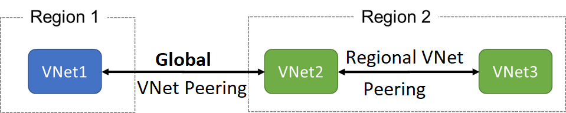
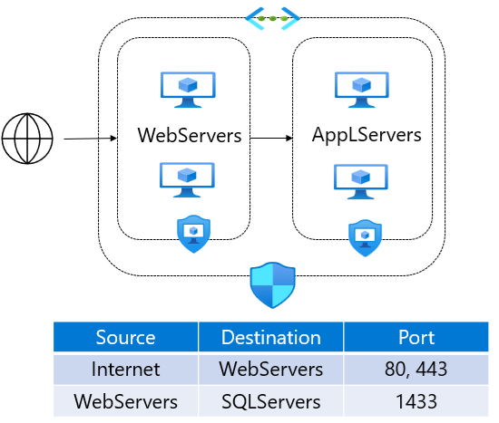

# Azure Virtual Network (Vnets)

## Vnet

<figure><figcaption></figcaption></figure>

* A **Virtual Network (VNet)** is a **logical isolation of Azure resources**
* Used to create **private networks in the cloud**

Azure Virtual Networks (VNets) enable secure communication between:

* Azure resources
* The internet
* On-premises infrastructure

### **Core Features**

* Supports **VPN setup** in Azure
* Uses **CIDR IP address ranges**
* Can connect to:
  * Other VNets
  * On-premises networks _(non-overlapping CIDR required)_
* Allows:
  * Custom **DNS configuration**
  * Network segmentation using **subnets**

## Azure Subnets&#x20;

Azure subnets provide a way to implement logical divisions within your virtual network.&#x20;

#### 🌐 **Subnet Fundamentals**

* Each subnet:
  * Uses a **range of IPs from the VNet address space**
  * Must have a **unique IP range across the virtual network**
  * **Cannot overlap** with other subnets
* Defined using **CIDR notation**
* A VNet can contain **multiple subnets**

## **Reserved IP address**

In every subnet, **5 IP addresses are reserved by Azure**:

<table data-full-width="true"><thead><tr><th>IP Address</th><th>Purpose</th></tr></thead><tbody><tr><td><code>.0</code></td><td>Network address</td></tr><tr><td><code>.1</code></td><td>Default gateway</td></tr><tr><td><code>.2, .3</code></td><td>Azure DNS</td></tr><tr><td>Last IP</td><td>Broadcast address</td></tr></tbody></table>

## VNet Peering

<figure><figcaption></figcaption></figure>

Virtual network peering enables you to seamlessly connect two Azure virtual networks. Once peered, the virtual networks appear as one, for connectivity purposes. There are two types of VNet peering.

* **Regional VNet peering** connects Azure virtual networks in the same region.
* **Global VNet peering** connects Azure virtual networks in different regions. The peered virtual networks can exist in any Azure public cloud region or China cloud regions, but not in Government cloud regions. You can only peer virtual networks in the same region in Azure Government cloud regions.

## Extended peering&#x20;

&#x20;Suppose you have three virtual networks: A, B, and C. You establish virtual network peering between networks A and B, and also between networks B and C. You don't set up peering between networks A and C. The virtual network peering capabilities that you set up between networks B and C don't automatically enable peering communication capabilities between networks A and C.

This is done with help of&#x20;

1. Hub and Spoke Network&#x20;
   1. User-defined route
   2. Service chaining

### Hub and Spoke Model&#x20;

<figure><figcaption></figcaption></figure>

**Hub-and-Spoke is a network architecture pattern** used in Azure to organize and secure multiple virtual networks.

* **Hub = central network**
* **Spokes = connected networks (applications/workloads)**


```
        Spoke1
           |
Spoke2 — Hub — Spoke3
           |
        Spoke4
```


#### Hub&#x20;

The **Hub VNet** contains shared services:

**Typical components:**

* Azure Firewall / NVA (Network Virtual Appliance)
* VPN Gateway / ExpressRoute Gateway
* Bastion Host (for secure access)
* DNS services
* Security monitoring tools

👉 Basically: **all core networking + security controls live here**

#### Spoke&#x20;

Each **Spoke VNet** hosts:

* Applications
* Databases
* Microservices
* Dev / Test / Prod environments

👉 Spokes are usually **isolated from each other**

### How they connect (UDR and Service Chaining)

* Hub ↔ Spoke = **VNet Peering**
* Spoke ↔ Spoke = ❌ (usually NOT directly connected)

👉 Traffic between spokes goes through the **Hub** with help of User defined routing and service chaining.&#x20;

<details>

<summary><strong>Understand UDR and Service Chaining</strong></summary>

## 1) Start with just two networks

```
Network A                    Network B
[ VM-A ]                     [ VM-B ]
10.0.0.4                     20.0.0.4
```

These are **two different VNets**.

By default:

```
[ VM-A ]   X   [ VM-B ]
```

They cannot talk directly. That is the starting point in the lab.

***

## 2) Then peering is added

Peering means:

> “Allow Network A and Network B to communicate.”

So after peering:

```
Network A   <-------- peering -------->   Network B
[ VM-A ]                                  [ VM-B ]
```

Now traffic can go directly:

```
[ VM-A ]  ---------------------------->  [ VM-B ]
```

So peering simply does this:

> **connect A and B**

That part you already understood.

***

## 3) Now where does custom route come in?

After peering, traffic goes directly.

```
[ VM-A ]  ---------------------------->  [ VM-B ]
             direct path
```

But suppose company says:

> “No, no. We do not want A to reach B directly.\
> First send traffic through a security device.”

That security device can be firewall/NVA.

Let’s call it **F**.

***

## 4) Add one more thing: firewall/device F

Now imagine A has one more subnet where the firewall sits:

```
Network A
+----------------------------------+
|  Subnet-1: VM-A                  |
|    [ VM-A ]                      |
|                                  |
|  Subnet-2: Firewall subnet       |
|    [ F ]                         |
+----------------------------------+

Network B
+----------------------------------+
|  [ VM-B ]                        |
+----------------------------------+
```

Right now, even if F exists, traffic may still go directly unless you tell Azure otherwise.

So still:

```
[ VM-A ]  ---------------------------->  [ VM-B ]
```

Why? Because Azure uses default routing unless you change it.

***

## 5) What is a custom route then?

Custom route means:

> “For this destination, do not go direct. Go to F first.”

That’s the whole idea.

***

## 6) Draw it simply

### Before custom route

```
A                                              B
[ VM-A ] ----------------------------------> [ VM-B ]
         direct traffic
```

### After custom route

```
A                                              B
[ VM-A ] -----> [ F ] ---------------------> [ VM-B ]
```

Now traffic is forced through F.

## 7) One final tiny drawing

```
BEFORE PEERING:
[VM-A]   X   [VM-B]

AFTER PEERING:
[VM-A] -------> [VM-B]

AFTER CUSTOM ROUTE:
[VM-A] ---> [F] ---> [VM-B]
```

**How it is achieved:**&#x20;

* **UDR:** It is UDR because a custom route overrides Azure’s default path to force traffic to a specific next hop (F).
* **Service chaining:** It is service chaining because traffic is intentionally made to pass through a service (F/firewall) before reaching the destination (B)

</details>


## Traffic Control&#x20;

### Routing&#x20;

Defines **how packets travel**

#### **Types:**&#x20;

**✅ System Routes**

* Default routes by Azure in which all VMs can communicate inside network
* It cannot be deleted but we can override them.

**Default system routes:**&#x20;

| Address prefix                | Next hop type   |
| ----------------------------- | --------------- |
| Unique to the virtual network | Virtual network |
| 0.0.0.0/0                     | Internet        |
| 10.0.0.0/8                    | None            |
| 172.16.0.0/12                 | None            |
| 192.168.0.0/16                | None            |
| 100.64.0.0/10                 | None            |

**✅ User Defined Routes (UDR)**

* Override system routes and force traffic via:
  * Firewall
  * NVA

### Virtual Network Gateway&#x20;

Use a virtual network gateway to send encrypted traffic between Azure and on-premises over the internet and to send encrypted traffic between Azure networks. A virtual network gateway contains routing tables and gateway services.

<figure><figcaption></figcaption></figure>

### Network Virtual Appliance (NVA)

A network virtual appliance (NVA) is a virtual appliance that consists of various layers like:

* A firewall
* A WAN optimizer
* Application-delivery controllers
* Routers
* Load balancers
* IDS/IPS
* Proxies

You can deploy NVAs that you choose from providers in Azure Marketplace. Such providers include Cisco, Check Point, Barracuda, Sophos, WatchGuard, and SonicWall. You can use an NVA to filter traffic inbound to a virtual network, to block malicious requests, and to block requests made from unexpected resources.

### Network Security Groups (NSG)

Layer 4 firewall (IP + Port based)

#### What it does:

* Allow / Deny traffic
* Works at:
  * Subnet level
  * NIC level

#### Key feature:

* Stateful (remembers connections)

#### Conditions for creating NSG

| Setting            | Value                                                                                                                                                                                                 |
| ------------------ | ----------------------------------------------------------------------------------------------------------------------------------------------------------------------------------------------------- |
| Source             | Any, IP Addresses, My IP address, Service Tag, or Application security group                                                                                                                          |
| Source port ranges | Specify the ports on which the rule allows or denies traffic                                                                                                                                          |
| Destination        | Any, IP Addresses, Service Tag, or Application security group                                                                                                                                         |
| Protocol           | Restrict the rule to the Transmission Control Protocol (TCP), User Datagram Protocol (UDP), or Internet Control Message Protocol (ICMP). The default is for the rule to apply to all protocols (Any). |
| Action             | Allow or Deny                                                                                                                                                                                         |
| Priority           | A value between 100 and 4,096 that's unique for all security rules within the NSG                                                                                                                     |

* Each security rule is assigned a Priority value. All security rules for a network security group are processed in priority order. When a rule has a low Priority value, the rule has a higher priority or precedence in terms of order processing.
* You can't remove the default security rules.
* You can override a default security rule by creating another security rule that has a higher Priority setting for your network security group.

#### Default Inbound and Outbound traffic&#x20;

* Inbound Rule: These rules **deny all inbound traffic** except traffic from your virtual network and Azure load balancers.
* Outbound Rule: These rules **only allow outbound traffic** to the internet and your virtual network.

<figure><figcaption></figcaption></figure>

<figure><figcaption></figcaption></figure>

### Application Security Groups (ASG)

#### What it is:

Logical grouping of VMs

<figure><figcaption></figcaption></figure>

You join your virtual machines to an application security group. Then you use the application security group as a source or destination in the network security group rules.


_Application Security Groups (ASG) let you group VMs logically, so you can apply NSG rules to the group instead of individual IP addresses._


### **Private Endpoint**

#### What it is:

Private connection to Azure services

#### What it does:

* Access services via **private IP**
* No internet involved

### **Service Endpoint**

#### What it is:

Extends VNet identity to Azure services

#### What it does:

* Secure connection to Azure services
* Still uses public endpoint (but restricted)


_Both Service Endpoints and Private Endpoints limit access to Azure resources to specific virtual networks. In Service Endpoints, the resource remains publicly accessible and uses a public IP, but access is restricted at the network level. In contrast, Private Endpoints assign a private IP to the resource within the VNet, eliminating the need for public exposure._

