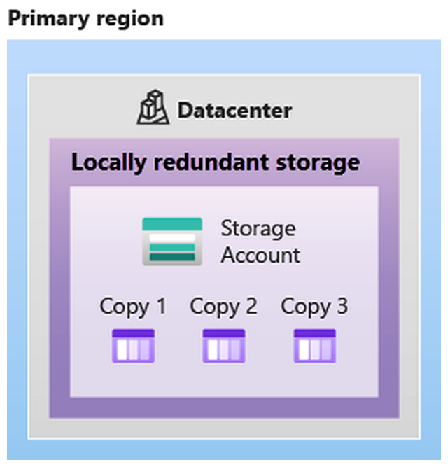

# Azure Storage Services

## Storage Account Endpoints

Every storage account in Azure must have a unique-in-Azure account name. The combination of the account name and the Azure Storage service endpoint forms the endpoints for your storage account.

**Rules:**&#x20;

* Storage account names must be between 3 and 24 characters in length and may contain numbers and lowercase letters only.
* Your storage account name must be unique within Azure. No two storage accounts can have the same name. This supports the ability to have a unique, accessible namespace in Azure.

<table data-full-width="true"><thead><tr><th>Storage service</th><th>Endpoint</th></tr></thead><tbody><tr><td>Blob Storage</td><td>https://&#x3C;storage-account-name>.blob.core.windows.net</td></tr><tr><td>Data Lake Storage Gen2</td><td>https://&#x3C;storage-account-name>.dfs.core.windows.net</td></tr><tr><td>Azure Files</td><td>https://&#x3C;storage-account-name>.file.core.windows.net</td></tr><tr><td>Queue Storage</td><td>https://&#x3C;storage-account-name>.queue.core.windows.net</td></tr><tr><td>Table Storage</td><td>https://&#x3C;storage-account-name>.table.core.windows.net</td></tr></tbody></table>

## Azure Storage Redundancy&#x20;

Azure Storage always stores multiple copies of your data so that it's protected from planned and unplanned events such as transient hardware failures, network or power outages, and natural disasters.

### Redundancy in the primary region


_Data in an Azure Storage account is always replicated three times in the primary region._&#x20;


Azure Storage offers two options for how your data is replicated in the primary region, locally redundant storage (LRS) and zone-redundant storage (ZRS).

#### Locally Redundant Storage (LRS)

* Data replicated 3 times
* Within a single datacenter in primary region.&#x20;
* Lowest-cost redundancy option
* Protects data against server rack and drive failures&#x20;
* But it doesn't protect against disaster such as fire or flooding occurs
* Provides durability of 11 nines (99.999999999%) of objects over a given year

<figure><figcaption></figcaption></figure>

#### Zone-redundant Storage

* Synchronously replicates across 3 availability zones in the primary region
* Provides durability of 12 nines (99.9999999999%) of objects over a given year
* With ZRS, your data is still accessible for both read and write operations even if a zone becomes unavailable.
* ZRS is also recommended for restricting replication of data within a country or region to meet data governance requirements.

<figure><figcaption></figcaption></figure>

### Redundancy in a secondary region&#x20;

* For applications requiring high durability, you can choose to additionally copy the data in your storage account to a secondary region that is hundreds of miles away from the primary region.&#x20;
* When you create a storage account, you select the primary region for the account. The paired secondary region is based on Azure Region Pairs, and can't be changed.
* By default, data in the secondary region isn't available for read or write access unless there's a failover to the secondary region.
* Azure Storage offers two options for copying your data to a secondary region: geo-redundant storage (GRS) and geo-zone-redundant storage (GZRS).&#x20;
  * GRS is similar to running LRS in two regions, and GZRS is similar to running ZRS in the primary region and LRS in the secondary region.
* If we enable read access to the secondary region, the data is always available, even when the primary region is running optimally. For read access enable (RA-GRS) or (RA-GZRS).
* If the primary region becomes unavailable, you can choose to fail over to the secondary region. After the failover has completed, the secondary region becomes the primary region, and you can again read and write data.


_Because data is replicated to the secondary region asynchronously, a failure that affects the primary region may result in data loss if the primary region can't be recovered. The interval between the most recent writes to the primary region and the last write to the secondary region is known as the recovery point objective (RPO). The RPO indicates the point in time to which data can be recovered. Azure Storage typically has an RPO of less than 15 minutes, although there's currently no SLA on how long it takes to replicate data to the secondary region._


#### Geo-Redundant Storage&#x20;

* Data is replicated **3 times synchronously** in the **primary region** using **LRS**
* Replication inside primary region occurs within a **single physical location (datacenter)**
* Data is then copied **asynchronously** to the **secondary region**
* Secondary region is the **Azure Region Pair**
* Secondary region stores **3 additional copies using LRS**
* Total copies = **6 copies (3 primary + 3 secondary)**
* Offers durability of at least **99.99999999999999% (16 nines) per year**

<figure><figcaption></figcaption></figure>

#### Geo-zone Redundant Storage&#x20;

* Combines **zone-level redundancy + geo-replication**
* Data is copied across **3 Availability Zones** in the **primary region** (like ZRS)
* Data is also replicated to a **secondary geographic region using LRS**
* Total copies:
  * 3 copies across zones (primary)
  * 3 copies in secondary region
  * **Total = 6 copies**
* Provides maximum availability, excellent performance and resilience for disaster recovery.&#x20;
* Offers durability of at least **99.99999999999999% (16 nines) per year**

<figure><figcaption></figcaption></figure>

## Azure Storage Services&#x20;

The Azure Storage platform includes the following data services:

* **Azure Blobs**: A massively scalable object store for text and binary data. Also includes support for big data analytics through Data Lake Storage Gen2.
* **Azure Files**: Managed file shares for cloud or on-premises deployments.
* **Azure Queues**: A messaging store for reliable messaging between application components.
* **Azure Disks**: Block-level storage volumes for Azure VMs.
* **Azure Tables:** NoSQL table option for structured, non-relational data.

### Azure Blobs (Binary Large Object)

* Cloud-based **object storage solution**
* Designed to store **massive amounts of data**
* It is unstructured and there is no restriction on the type of data it holds.&#x20;
* It can store anything irrespective of the data type and size.&#x20;
* Supports thousands of simultaneous uploads.
* It can store binary data streamed from a scientific instrument or custom format for an app.&#x20;
* Data is uploaded as blobs, and Azure takes care of the physical storage needs.&#x20;

#### Access&#x20;

Users or client applications can access blobs using:

* **Direct URL**
* **Azure Storage REST API**
* **Azure PowerShell**
* **Azure CLI**
* **Azure Storage Client Libraries**
* Azure provides SDKs for multiple programming languages:
  * .NET
  * Java
  * Node.js
  * Python
  * PHP
  * Ruby

#### Blob Storage tiers&#x20;

To accommodate different access needs, Azure provides several access tiers, which you can use to balance your storage costs with your access needs.

&#x20;The available access tiers include:

* **Hot access tier**: Optimized for storing data that is accessed frequently (for example, images for your website).
* **Cool access tier**: Optimized for data that is infrequently accessed and stored for at least 30 days (for example, invoices for your customers).
* **Cold access tier**: Optimized for storing data that is infrequently accessed and stored for at least 90 days.
* **Archive access tier**: Appropriate for data that is rarely accessed and stored for at least 180 days, with flexible latency requirements (for example, long-term backups).


_Archive storage stores data offline and offers the lowest storage costs, but also the highest costs to rehydrate and access data._


### Azure Files&#x20;

* Fully managed **file shares in the cloud**
* Accessible using industry-standard protocols:
  * **SMB (Server Message Block)** \[Both Windows and Linux]
  * **NFS (Network File System)** \[Linux Only]
* Azure File Sync
  * SMB shares can be cached on **Windows Servers**
  * Uses **Azure File Sync**
  * Provides:
    * Faster local access
    * Hybrid cloud integration
    * Frequently accessed data stored locally

### Azure Queues

* Store large number of messages.&#x20;
* Can store up to millions of message with each message can be upto 64kb in size.&#x20;
* Commonly used to create a backlog of work.
* Can be combined with Azure functions to take an action when a message is received.&#x20;

For example, you want to perform an action after a customer uploads a form to your website. You could have the submit button on the website trigger a message to the Queue storage. Then, you could use Azure Functions to trigger an action once the message was received.

### Azure Disks&#x20;

Azure Disk storage, or Azure managed disks, are block-level storage volumes managed by Azure for use with Azure VMs. Conceptually, they’re the same as a physical disk, but they’re virtualized – offering greater resiliency and availability than a physical disk. With managed disks, all you have to do is provision the disk, and Azure will take care of the rest.

### Azure tables&#x20;

Azure Table storage stores large amounts of structured data. Azure tables are a NoSQL datastore that accepts authenticated calls from inside and outside the Azure cloud. This enables you to use Azure tables to build your hybrid or multicloud solution and have your data always available. Azure tables are ideal for storing structured, non-relational data.

## Azure Data Migration Options&#x20;

Azure supports both real-time migration of infrastructure, applications, and data using Azure Migrate as well as asynchronous migration of data using Azure Data Box.

### Azure Migrate&#x20;

Azure Migrate is a service that helps you migrate from an on-premises environment to the cloud.

#### Integrated Tools&#x20;

* **Azure Migrate: Discovery and assessment**. Discover and assess on-premises servers running on VMware, Hyper-V, and physical servers in preparation for migration to Azure.
* **Azure Migrate: Server Migration**. Migrate VMware VMs, Hyper-V VMs, physical servers, other virtualized servers, and public cloud VMs to Azure.
* **Data Migration Assistant**. Data Migration Assistant is a stand-alone tool to assess SQL Servers. It helps pinpoint potential problems blocking migration. It identifies unsupported features, new features that can benefit you after migration, and the right path for database migration.
* **Azure Database Migration Service**. Migrate on-premises databases to Azure VMs running SQL Server, Azure SQL Database, or SQL Managed Instances.
* **Azure App Service migration assistant**. Azure App Service migration assistant is a standalone tool to assess on-premises websites for migration to Azure App Service. Use Migration Assistant to migrate .NET and PHP web apps to Azure.
* **Azure Data Box**. Use Azure Data Box products to move large amounts of offline data to Azure.

### Azure Data Box&#x20;

* A **physical data migration service**
* Used to transfer **large amounts of data**
* Fast, cost-effective, and reliable
* Ideal for:
  * Initial cloud migration
  * Large dataset transfer
  * Limited bandwidth scenarios
* Microsoft ships a **proprietary Data Box device**
* Maximum usable capacity: **80 TB**
* Rugged and tamper-resistant case
* Secure data transfer
* Transported via **regional carrier**

#### Workflow



### Order Device

* Request Data Box through **Azure Portal**
* Choose:
  * Import to Azure
  * Export from Azure



### Data Transfer

* Receive device at your datacenter
* Configure via **local web UI**
* Connect to your network
* Copy data into or out of the device



### Return Device

* Ship device back to Microsoft
* If importing:
  * Data automatically uploaded to Azure
* Entire process tracked in Azure Portal



Here are the various scenarios where Data Box can be used to import data to Azure.

* Onetime migration - when a large amount of on-premises data is moved to Azure.
* Moving a media library from offline tapes into Azure to create an online media library.
* Migrating your VM farm, SQL server, and applications to Azure.
* Moving historical data to Azure for in-depth analysis and reporting using HDInsight.
* Initial bulk transfer - when an initial bulk transfer is done using Data Box (seed) followed by incremental transfers over the network.
* Periodic uploads - when large amount of data is generated periodically and needs to be moved to Azure.

## Azure File Movement Options&#x20;

### AzCopy

* A **command-line utility**
* Used to copy data to and from **Azure Storage**
* Used to upload files, download files, copy files and even synchronize files
* Supports:
  * Blob Storage
  * Azure Files
* Can transfer data:
  * Between Azure storage accounts
  * Between on-premises and Azure
  * Between Azure and other cloud providers


_Synchronizing blobs or files with AzCopy is one-direction synchronization. When you synchronize, you designate the source and destination, and AzCopy will copy files or blobs in that direction. It doesn't synchronize bi-directionally based on timestamps or other metadata._


### Azure Storage Explorer&#x20;

Azure Storage Explorer is a standalone app that provides a graphical interface to manage files and blobs in your Azure Storage Account. It works on Windows, macOS, and Linux operating systems and uses AzCopy on the backend to perform all of the file and blob management tasks. With Storage Explorer, you can upload to Azure, download from Azure, or move between storage accounts.

### Azure File Sync&#x20;

Azure File Sync is a tool that lets you centralize your file shares in Azure Files and keep the flexibility, performance, and compatibility of a Windows file server. It’s almost like turning your Windows file server into a miniature content delivery network. Once you install Azure File Sync on your local Windows server, it will automatically stay bi-directionally synced with your files in Azure.

With Azure File Sync, you can:

* Use any protocol that's available on Windows Server to access your data locally, including SMB, NFS, and FTPS.
* Have as many caches as you need across the world.
* Replace a failed local server by installing Azure File Sync on a new server in the same datacenter.
* Configure cloud tiering so the most frequently accessed files are replicated locally, while infrequently accessed files are kept in the cloud until requested.
