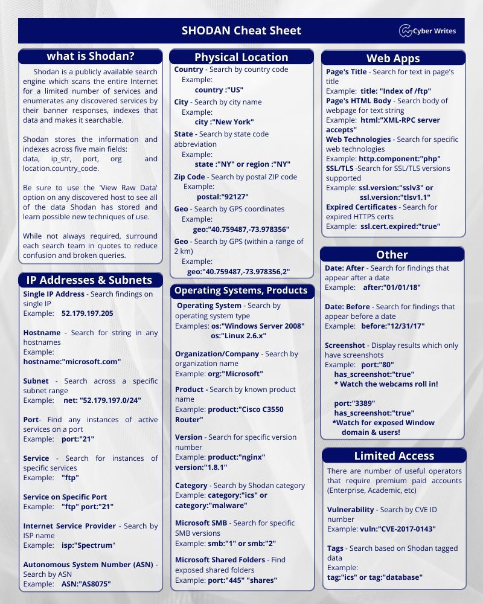

# Wide Recon

<div data-full-width="true"><figure><figcaption><p><a href="https://xmind.ai/share/jbOBlV2T">https://xmind.ai/share/jbOBlV2T</a></p></figcaption></figure></div>

## ASNs to IPs/Subdomains

An Autonomous System Number (ASN) is a unique identifier assigned to networks that manage their own routing, typically ISPs or large organizations. For bug hunters, ASNs help map an organization's IP ranges, revealing hidden assets, subdomains, and infrastructure that may not be publicly listed. This expands the attack surface, increasing the chances of finding vulnerabilities.

**Discovery Steps:**&#x20;

* Find ASN numbers
  * Using Keyword or search terms in third party tools
    * Hurricane services: [<mark style="color:red;">`https://bgp.he.net`</mark>](https://bgp.he.net) (best)
    * HackerTarget: [<mark style="color:red;">`https://hackertarget.com/as-ip-lookup/`</mark>](https://hackertarget.com/as-ip-lookup/) (best)
    * ASN Info: [<mark style="color:red;">`https://asn.ipinfo.app/search`</mark>](https://asn.ipinfo.app/search)
    * ASN Lookup:  [<mark style="color:red;">`https://asnlookup.com/`</mark>](https://asnlookup.com/)&#x20;
    * Using Amass: `amass intel -org Tesla`  (False Positive Possible)
  * Using official RIRs (Regional Internet Registries)
    * ARIN (America): [<mark style="color:red;">`https://whois.arin.net/ui/query.do`</mark>](https://whois.arin.net/ui/query.do)
    * APNIC (Asia-Pacific)
    * RIPE NCC (Europe, Middle-East, Central Asia)
    * LACNIC (Latin America and Caribbean)
    * AFRINIC (Africa)
  * Using apex domain
    * ProjectDiscovery: [<mark style="color:red;">`cloud.projectdiscovery.io`</mark>](https://cloud.projectdiscovery.io)&#x20;
* Enumerating IP Address Range from ASN numbers
  * IPInfo DB: [<mark style="color:red;">`https://ipinfo.io/account/search`</mark>](https://ipinfo.io/account/search) (Sign-in Required) \[best]
  * HackerTarget: [<mark style="color:red;">`https://hackertarget.com/as-ip-lookup/`</mark>](https://hackertarget.com/as-ip-lookup/)
  * ASN Info: [<mark style="color:red;">`https://asn.ipinfo.app/search`</mark>](https://asn.ipinfo.app/search)
  * ASNmap Tool:  `asnmap tool`
* IP Address Range to subdomain (Possibly New)
  * Using certificate (Provides subject alternative name and common name)
    * `echo '<subnet>' | ./tlsx -san -cn`
  * Using Reverse IP Lookup
    * Reverse IP Lookup: [<mark style="color:red;">`https://mxtoolbox.com/ReverseLookup.aspx`</mark>](https://mxtoolbox.com/ReverseLookup.aspx)
    * Reverse IP Lookup: `dig -x <IP>`
    * dnsrecon: `dnsrecon -r <subnet>`
* Get subdomain back directly from ASN Number&#x20;
  * Using Shodan (Given below)

> **Note:** If you identify that a cloud service (e.g., AWS, Azure, GCP) is being used during a reverse DNS lookup, stop the process at that point. This is because it's unlikely to resolve to the actual apex or subdomain—instead, it typically resolves to a generic cloud instance (e.g., an EC2 hostname), which is not useful for further enumeration.
>
> [#web-application-on-cloud](../web-essentials.md#web-application-on-cloud "mention")

## Getting data with [whoisxmlapi](../tools/whoisxmlapi.md)

## Shodan

Shodan continuously scans internet-connected devices, indexing their open ports, services, and banners. It acts as a search engine for exposed systems, including servers, IoT devices, databases, webcams, and industrial control systems. Security researchers and bug hunters use Shodan to discover misconfigurations, outdated software, and publicly accessible assets that may be vulnerable to attacks.

What are we after ?&#x20;

* Shodan will give us passive subdomains, IP addresses, vulnerability data and much more.&#x20;

### Shodan search using ASN number

<figure><figcaption></figcaption></figure>

### Shodan search using CIDR

<figure><figcaption></figcaption></figure>

### Shodan Cheatsheet

<div data-full-width="true"><figure><figcaption></figcaption></figure></div>

### Automated Shodan

* Karma v2 (Requires Shodan Premium) \[Most Effective]
*   [Shosubgo](../tools/shoshubgo.md)\


    <figure><figcaption></figcaption></figure>

## Finding Company Acquisitions

* **Using Crunchbase**
* **tracxn.com**
* **owler.com**
* **ReconGPT**

## Subdomain Scraping

### Using Tools

Great tools for finding subdomains:&#x20;

* [bbot ](../tools/bbot-advanced-subdomain-enumerator.md)(API Keys required)
* [theHarvester ](../tools/theharvester.md)(API keys required)
* subfinder: `subfinder -d [domain]`

### By Fuzzing

* dnsenum
* ffuf
* gobuster

### From Github

This tool searches for the specified domain using the api key we provided in the GitHub and hence is very useful.&#x20;

```
github-subdomains -d <domain> -t <github_token>
```

## Subdomain Enumeration Commands Generator


```bash
#!/bin/bash

# ANSI Colors
RED="\e[31m"
GREEN="\e[32m"
YELLOW="\e[33m"
BLUE="\e[34m"
BOLD="\e[1m"
NC="\e[0m"

# Take inputs
read -p $'\e[33;1mEnter domain (e.g., example.com): \e[0m' DOMAIN
read -p $'\e[33;1mEnter GitHub API key: \e[0m' GH_API
read -p $'\e[33;1mEnter Shodan API key: \e[0m' SHODAN_API

# Extract base
BASE=$(echo "$DOMAIN" | cut -d '.' -f1)

# Create folder structure
mkdir -p "${BASE}/recon/sub_enum/dump"
echo "$DOMAIN" > "${BASE}/scope.txt"

# Output file
COMMANDS_FILE="commands.txt"

# Save colored commands to file
{
  printf "${BLUE}${BOLD}# Wide Recon${NC}\n"
  printf "${GREEN}## Subdomain Enumeration${NC}\n"

  printf "${YELLOW}### Using Subfinder${NC}\n"
  printf "subfinder -d $DOMAIN -all -recursive -silent -o ${BASE}/recon/sub_enum/dump/subs.txt\n\n"

  printf "${YELLOW}### Using github-subdomains${NC}\n"
  printf "github-subdomains -d $DOMAIN -o ${BASE}/recon/sub_enum/dump/git_subs.txt -t $GH_API\n\n"

  printf "${YELLOW}### Using Shosubgo${NC}\n"
  printf "shosubgo -s $SHODAN_API -d $DOMAIN -o ${BASE}/recon/sub_enum/dump/shosubgo_subs.txt\n\n"

  printf "${GREEN}## Gather Unique Subdomains${NC}\n"
  printf "cat ${BASE}/recon/sub_enum/dump/subs.txt "
  printf "${BASE}/recon/sub_enum/dump/git_subs.txt "
  printf "${BASE}/recon/sub_enum/dump/shosubgo_subs.txt | anew > ${BASE}/recon/sub_enum/dump/all_uniq_subs.txt\n\n"

  printf "${GREEN}## Check Alive Subdomains${NC}\n"
  printf "cat ${BASE}/recon/sub_enum/dump/all_uniq_subs.txt | httpx-toolkit -ports 80,443,8080,8000,8888,8443,3000 -o ${BASE}/recon/sub_enum/dump/alive_subs.txt -mc 200 -t 150\n"
  printf "cat ${BASE}/recon/sub_enum/dump/all_uniq_subs.txt | httpx-toolkit -ports 80,443,8080,8000,8888,8443,3000 -o ${BASE}/recon/sub_enum/dump/redir_subs.txt -mc 302 -t 150\n\n"

  printf "${GREEN}## Clean Output (remove protocols, deduplicate)${NC}\n"
  printf "cat ${BASE}/recon/sub_enum/dump/alive_subs.txt | sed 's|http[s]*://||' | sort -u > ${BASE}/recon/sub_enum/alive_subs.txt\n"
  printf "cat ${BASE}/recon/sub_enum/dump/redir_subs.txt | sed 's|http[s]*://||' | sort -u > ${BASE}/recon/sub_enum/redir_subs.txt\n"
  printf "cat ${BASE}/recon/sub_enum/alive_subs.txt ${BASE}/recon/sub_enum/redir_subs.txt | anew > ${BASE}/recon/sub_enum/combined.txt\n\n"

  printf "${BLUE}bbot -t $DOMAIN -p subdomain-enum -o . -n bbot_results -om txt${NC}\n\n"

  printf "${GREEN}${BOLD}✅ Subdomain enumeration is done.${NC}\n"
  printf "${YELLOW}You can go with these results for hunting but don't forget to use bbot for more results and findings.${NC}\n"
} > "$COMMANDS_FILE"

# Show output to terminal
cat "$COMMANDS_FILE"


```



```bash
#!/bin/bash

# ANSI Colors
RED="\e[31m"
GREEN="\e[32m"
YELLOW="\e[33m"
BLUE="\e[34m"
MAGENTA="\e[35m"
CYAN="\e[36m"
BOLD="\e[1m"
NC="\e[0m"

# Take inputs
read -p $'\e[33;1mEnter domain (e.g., example.com): \e[0m' DOMAIN
read -p $'\e[33;1mEnter GitHub API key: \e[0m' GH_API
read -p $'\e[33;1mEnter Shodan API key: \e[0m' SHODAN_API

# Extract base
BASE=$(echo "$DOMAIN" | cut -d '.' -f1)

# Create folder structure
mkdir -p "${BASE}/recon/sub_enum/dump"
echo "$DOMAIN" > "${BASE}/scope.txt"

# Output file
COMMANDS_FILE="commands.txt"

# Save colored commands to file and terminal
{
  toilet -f digital 'JS recon & Analysis' | lolcat --force -p 1

  toilet -F border -f term "Subdomain Enumeration" | lolcat --force -p 0.2

  echo -e "${CYAN}▶ subfinder -d $DOMAIN -all -recursive -silent -o ${BASE}/recon/sub_enum/dump/subs.txt${NC}"
  echo -e "${MAGENTA}────────────────────────────────────────────────────────────────────${NC}"
  echo -e "${CYAN}▶ github-subdomains -d $DOMAIN -o ${BASE}/recon/sub_enum/dump/git_subs.txt -t $GH_API${NC}"
  echo -e "${MAGENTA}────────────────────────────────────────────────────────────────────${NC}"
  echo -e "${CYAN}▶ shosubgo -s $SHODAN_API -d $DOMAIN -o ${BASE}/recon/sub_enum/dump/shosubgo_subs.txt${NC}"

  toilet -F border -f term "Gather Unique Subdomains" | lolcat --force -p 0.2
  echo -e "${CYAN}▶ cat ${BASE}/recon/sub_enum/dump/subs.txt ${BASE}/recon/sub_enum/dump/git_subs.txt ${BASE}/recon/sub_enum/dump/shosubgo_subs.txt | anew > ${BASE}/recon/sub_enum/dump/all_uniq_subs.txt${NC}"

  toilet -F border -f term "Check Alive Subdomains" | lolcat --force -p 0.2
  echo -e "${CYAN}▶ cat ${BASE}/recon/sub_enum/dump/all_uniq_subs.txt | httpx-toolkit -ports 80,443,8080,8000,8888,8443,3000 -o ${BASE}/recon/sub_enum/dump/alive_subs.txt -mc 200 -t 150${NC}"
  echo -e "${MAGENTA}────────────────────────────────────────────────────────────────────${NC}"
  echo -e "${CYAN}▶ cat ${BASE}/recon/sub_enum/dump/all_uniq_subs.txt | httpx-toolkit -ports 80,443,8080,8000,8888,8443,3000 -o ${BASE}/recon/sub_enum/dump/redir_subs.txt -mc 302 -t 150${NC}"

  toilet -F border -f term "Clean Output" | lolcat --force -p 0.2
  echo -e "${CYAN}▶ cat ${BASE}/recon/sub_enum/dump/alive_subs.txt | sed 's|http[s]*://||' | sort -u > ${BASE}/recon/sub_enum/alive_subs.txt${NC}"
  echo -e "${MAGENTA}────────────────────────────────────────────────────────────────────${NC}"
  echo -e "${CYAN}▶ cat ${BASE}/recon/sub_enum/dump/redir_subs.txt | sed 's|http[s]*://||' | sort -u > ${BASE}/recon/sub_enum/redir_subs.txt${NC}"
  echo -e "${MAGENTA}────────────────────────────────────────────────────────────────────${NC}"
  echo -e "${CYAN}▶ cat ${BASE}/recon/sub_enum/alive_subs.txt ${BASE}/recon/sub_enum/redir_subs.txt | anew > ${BASE}/recon/sub_enum/combined.txt${NC}"

  toilet -F border -f term "Extra Enumeration" | lolcat --force -p 0.2
  echo -e "${CYAN}▶ bbot -t $DOMAIN -p subdomain-enum -o . -n bbot_results -om txt${NC}"

  echo -e "\n${GREEN}${BOLD}✅ Subdomain enumeration is done.${NC}"
  echo -e "${YELLOW}You can go with these results for hunting but don't forget to use bbot for more results and findings.${NC}"

} | tee "$COMMANDS_FILE"

```


## Subdomain Enumeration Automation


```bash
#!/bin/bash

# ANSI Colors
RED="\e[31m"
GREEN="\e[32m"
YELLOW="\e[33m"
BLUE="\e[34m"
BOLD="\e[1m"
NC="\e[0m"

# Take inputs
read -p $'\e[33;1mEnter domain (e.g., example.com): \e[0m' DOMAIN
read -p $'\e[33;1mEnter GitHub API key: \e[0m' GH_API
read -p $'\e[33;1mEnter Shodan API key: \e[0m' SHODAN_API

# Extract base
BASE=$(echo "$DOMAIN" | cut -d '.' -f1)

# Create folder structure
RECON_DIR="${BASE}/recon/sub_enum"
DUMP_DIR="${RECON_DIR}/dump"
mkdir -p "$DUMP_DIR"
echo "$DOMAIN" > "${BASE}/scope.txt"

echo -e "${BLUE}${BOLD}[*] Starting Recon Automation...${NC}"

# Subfinder
echo -e "${YELLOW}[+] Running Subfinder...${NC}"
subfinder -d "$DOMAIN" -all -recursive -silent -o "$DUMP_DIR/subs.txt"

# github-subdomains
echo -e "${YELLOW}[+] Running github-subdomains...${NC}"
github-subdomains -d "$DOMAIN" -o "$DUMP_DIR/git_subs.txt" -t "$GH_API"

# Shosubgo
echo -e "${YELLOW}[+] Running shosubgo...${NC}"
shosubgo -s "$SHODAN_API" -d "$DOMAIN" -o "$DUMP_DIR/shosubgo_subs.txt"

# Gather unique
echo -e "${GREEN}[+] Gathering unique subdomains...${NC}"
cat "$DUMP_DIR/subs.txt" "$DUMP_DIR/git_subs.txt" "$DUMP_DIR/shosubgo_subs.txt" | anew > "$DUMP_DIR/all_uniq_subs.txt"

# Alive check
echo -e "${BLUE}[+] Probing for live subdomains... (200 OK)${NC}"
cat "$DUMP_DIR/all_uniq_subs.txt" | httpx-toolkit -ports 80,443,8080,8000,8888,8443,3000 -o "$DUMP_DIR/alive_subs.txt" -mc 200 -t 150

echo -e "${BLUE}[+] Probing for redirected subdomains... (302)${NC}"
cat "$DUMP_DIR/all_uniq_subs.txt" | httpx-toolkit -ports 80,443,8080,8000,8888,8443,3000 -o "$DUMP_DIR/redir_subs.txt" -mc 302 -t 150

# Clean and deduplicate
echo -e "${YELLOW}[+] Cleaning and removing protocols...${NC}"
cat "$DUMP_DIR/alive_subs.txt" | sed 's|http[s]*://||' | sort -u > "$RECON_DIR/alive_subs.txt"
cat "$DUMP_DIR/redir_subs.txt" | sed 's|http[s]*://||' | sort -u > "$RECON_DIR/redir_subs.txt"

# Combined output
cat "$RECON_DIR/alive_subs.txt" "$RECON_DIR/redir_subs.txt" | anew > "$RECON_DIR/combined.txt"

# Done
echo -e "\n${GREEN}${BOLD}✅ Subdomain enumeration is done.${NC}"
echo -e "${YELLOW}You can go with these results for hunting but don't forget to use bbot for more results and findings.${NC}"
echo -e "${BLUE}Hint: bbot -t $DOMAIN -p subdomain-enum -o . -n bbot_results -om txt${NC}"

```


To check new things found in bbot we can use:&#x20;


```bash
cat bbot_subs.txt | anew combined.txt 
#combined.txt from the above result which consist of both alive and redir subs. 
```


<figure><figcaption></figcaption></figure>
